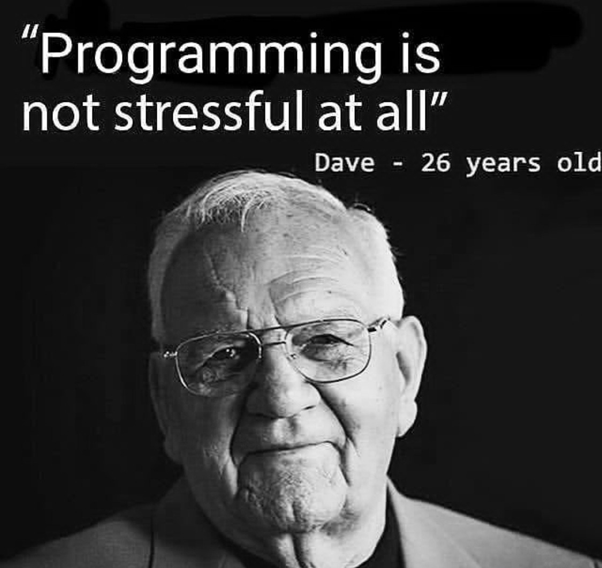

# Barcelona Code School

## JavaScript Full-Stack Bootcamp 

### 👉 👉 👉 [Read me first](./js_cur/JS-Full-Stack-Bootcamp-Daily-Workflow.md) 👈 👈 👈

## Important links

👉 Booking 1:1 session for the online students: https://calendly.com/barcelonacodeschool/1-1-sessions-with-online-students

👉 Support platform for code-related questions:
https://gitlab.com/gk3000/BCS_JS_BOOTCAMP_FILES_TDD/-/issues

👉 Wiki for the JavaScript part of the curriculum:
https://gitlab.com/gk3000/BCS_JS_BOOTCAMP_FILES_TDD/-/wikis/home

<!--  -->
