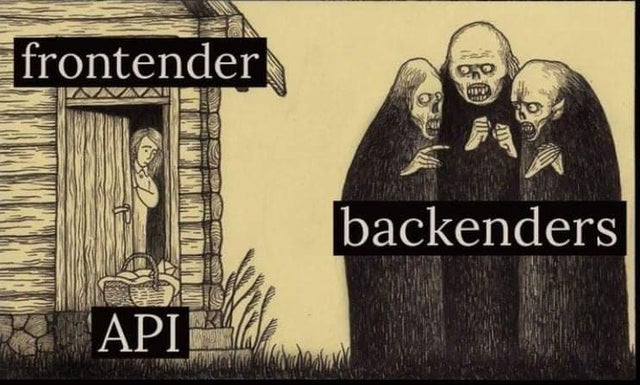

# Intro to back-end

> We strongly recommend to finish all of React exercises before starting with Express. Please push all of your React solutions to GitLab and notify your mentors so we will check them and give you a green light to start with Express. Thanks!

> Express official documentation: http://expressjs.com

---

<details>
    <summary>🎬 Video: Express - setup, intro, passing data via params</summary><div class='video-container'>
        <iframe src="https://www.youtube.com/embed/Qg0cy3XH0XE?rel=0" frameborder="0" allow="accelerometer; autoplay; encrypted-media; gyroscope; picture-in-picture" allowfullscreen ></iframe></div>
</details>

---

Sample code from the video lesson:

<iframe height="400px" width="100%" src="https://repl.it/@gk3000/express-setup-passing-data-via-params?lite=true" scrolling="no" frameborder="no" allowtransparency="true" allowfullscreen="true" sandbox="allow-forms allow-pointer-lock allow-popups allow-same-origin allow-scripts allow-modals"></iframe>

---



<p style="text-align: center;">Backenders deliver API to the frontenders 😈</p>

---

## Servers and Express

### Server - Browser Communication
What are servers?
Servers are things that serve something… Or more specifically a server is a computer program that provides services to other computer programs (and their users) on the same or other computers.
In our case a server is a soft/hardware system that provides resources to a browser.
HTTP - communication protocol
We use HTTP - HyperText Transfer Protocol - a series of rules which form protocol used to transfer information between servers and browsers.

<!--  -->


HTTP characteristics
A HTTP message is a text file with 3 parts:

-   A page address - URL (Unique Resource Locator)
-   Some extra information useful for the browser
-   And a body containing the actual message: HTML, JS, CSS, etc...

URL elements
The URL has 4 components

-   The type of protocol (there are other communication protocols exist)
-   The host/domain name
-   The path/route - a way to specify that the server should do; like a function name. If there is nothing the path/route will be (“/”)
-   Possible query parameters: some extra info that the user can send to the server

Example
http://www.google.com/home?name=joe&age=35

> Attention: the URL can have 2083 characters at most

### Express

Express is server framework for Node.js which provides a set of handy features to work with our web/mobile front-end apps. Express reads the incoming HTTP request and according to the URL, responds with a specific resource.

At the core Express is a method to link the request route to a function, so to execute a function you need to hit a certain URL.

<!--  -->


<!-- 

 -->

### Setup Express Project

    > npm init

. . . press enter or add the information you want to complete the package.json

    > npm install express --save
    > touch server.js

. . . once the right code has been added to server.js

    > node server.js

To make your server restart every time you change the code and save the files please install [**nodemon** package](https://www.npmjs.com/package/nodemon) (which stands for "node monitor"):

Windows:
`npm install -g nodemon`

Mac:
`sudo npm install -g nodemon`

After that from your project folder run `nodemon`

### Require

Exporting and Importing

Require is a way to import functionalities from other files (also called modules) in Node.js
In order to use external files or modules in Express we need to 'require' them (a.k.a. load and link them into your app). The syntax to import external files is:

```javascript
    const fileToToBeImported = require('./myFiles/fileToToBeImported')
```

In case of Express we would do it this way:

```javascript
    const express = require('express')
```

At this point we have imported the Express framework and we can start using it! Oops not yet!
In order to start making routes we need to assign the executed Express to a new variable which is conventionally called 'app'.

```javascript
    const app = express()
```

At this point we have the full power of Express available for us under the `app` variable and we can start making routes!

```javascript
    app.get('/',(req, res)=>{
    // the first argument of this function is the request object
    // the second argument is the response object
    // they are usually shortened to req and res
    res.send("reached the home page!")
    })
```

In order to have an Express server running we also need to use our variable `app` to add a listener.

```javascript
    const port = process.env.PORT || 3000
    //process.env.PORT will be used when we deploy...
    app.listen(port,( )=>{
        console.log('***server running on port***', port)
    })
```

> Attention: `console.log()` output will be printed in the terminal where you are running your server, not in the browser! 

### npm: Node package manager

To import new functionalities from other developers we use npm (node package manager).
To install a new functionality (package/module) we do

    > npm install NameOfNewPackage [-g --save]

If we use “`-g`” then the package will be installed globally and will be available for all of your projects. With a few exceptions, like `nodemon`, this is not recommended.

Instead “`--save`” will add the name of the package to the package.json file in your project’s root directory. This file keeps track of all the packages that you are using for your current app.

> There are tons of packages that can be used to save you time from coding something that someone else has already coded. As a rule use a package that contains lots of code, avoid using small packages whose functionalities you can rewrite quickly.

### Route Controller
Routes in Express take two arguments: a URL and a function. The latter takes 2 arguments. The first one is the request argument, which contains info about the request, the second one is the response that contains all the methods necessary to send back a response.

```javascript
    app.get('/',  (request, response) => {
    response.send('Hello World!') // <= This will appear in your browser
    })
```

In order for us to pass data through the url we can use params.

```javascript
    app.get('/home/:data',  (request, response) =>{
    let passedData = request.params.data
    response.send('Your params are: '+passedData+'') // <= This will appear in your browser
    })
```

By including a colon before the text in the path (url) we are able to pass variables or text to our route.

Please note that these two examples are not the same and that the colon makes a big difference.

The first example won’t work, since `stuff` is part of url but not the actual parameter we can pass, while the second will.

```javascript
    app.get('/home/stuff',(req,res)=>{
        let data = req.params.stuff
    })


    app.get('/home/:stuff',(req,res)=>{
        let data = req.params.stuff
    })
```

### Order matters

Express will execute the controller functions according to the method/route of the HTTP request. If two or more of these address are in conflict (that is to say they are equivalent) the first one in order of declaration will be used.

> In the following example we are never going to see the output of 'Welcome back!'

```javascript
    app.get('/user/:name/:age',  (req, res) => {
        res.send('Hello ' + req.params.name + '. Your age is: '+ req.params.age)
    })

    app.get('/user/gk/BCN',  (req, res) => {
        res.send('Welcome back')
    })
```

### Returning data from server

Similar to plain JavaScript functions every Express function also returns some data inside `response.send()`method which is equivalent to `return` statement in plain JavaScript function. 

We can only execute one `response.send()` statement. If you will try to `res.send()` twice you will get the `Cannot set headers after they are sent to the client` error message. 

For example:
```javascript
    app.get('/user/gk/BCN',  (req, res) => {
        res.send('Welcome back')
        res.send('Trying to return again')
    })
```

Of course we can put a condition to decide which `res.send()` should trigger:
```javascript
    app.get('/user/:name',  (req, res) => {
        if(req.params.name === 'Mike'){
            res.send('Hello ' + req.params.name + '. Welcome back!')
        }else{
            res.send('Hello new friend!')
        }
    })
```

In most cases your server will be returning more data than just a string and in this way we usually use objects in this way:

```javascript
    app.get('/hello',  (req, res) => {
        res.send({ ok: true, data: 'Hello World' })
    })
// or if something went wrong we can do
    app.get('/hello',  (req, res) => {
        res.send({ ok: false, data: 'No data' })
    })
```

So by the key `ok` in the client we can already tell if request was successful or not. 

---

## Testing Express Exercises

<details>
    <summary>🎬 Video: Express -- testing exercises</summary><div class='video-container'>
        <iframe width="560" height="315" src="https://www.youtube.com/embed/ymvHGql3uqE?rel=0" frameborder="0" allow="accelerometer; autoplay; encrypted-media; gyroscope; picture-in-picture" allowfullscreen></iframe></div>
</details>

---

## Exercise time!

---

> For the in-person group

> There is a handy way how you can share your servers for us, mentors, to test from our laptops:

> 1. Start your server
> 2. Find your local IP address from the terminal with a command

> `ifconfig`

> You local IP would probably be in your `en0` interface with 192.168.1.\*\*\* , last digits would vary. 3. Send us this ip address with port of your app, such as 192.168.1.48:8000

## To easily deploy and test your back-end apps you can use Heroku

Here is a guide to deploy Node.js app on Heroku: https://devcenter.heroku.com/articles/deploying-nodejs
