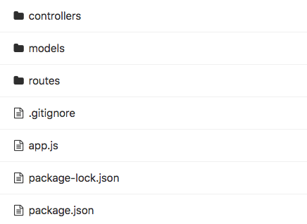

# Express block 03: MongoDB

---

<details>
    <summary>🎬 Video: MongoDB</summary><div class='video-container'>
        <iframe src="https://www.youtube.com/embed/0VfB_g9oOq0?rel=0" frameborder="0" allow="accelerometer; autoplay; encrypted-media; gyroscope; picture-in-picture" allowfullscreen ></iframe></div>
</details>

---

<details>
    <summary>🎬 Video: Express - using debugger</summary><div class='video-container'>
        <iframe src="https://www.youtube.com/embed/EhqpSNrK1zA?rel=0" frameborder="0" allow="accelerometer; autoplay; encrypted-media; gyroscope; picture-in-picture" allowfullscreen ></iframe></div>
</details>

---

Code from the video lesson for you to check the file structure (the DB will not work since we are trying to connect to the local DB and it's not there on repl.it):

<iframe height="400px" width="100%" src="https://repl.it/@gk3000/express-mongodb?lite=true" scrolling="no" frameborder="no" allowtransparency="true" allowfullscreen="true" sandbox="allow-forms allow-pointer-lock allow-popups allow-same-origin allow-scripts allow-modals"></iframe>

---

[To see about async and await you can read the following, which also explains promises](js_cur/_react/Promises.md)

Before going over the database we need to refactor our structure to make it a bit cleaner as at the moment we have been running all our code inside app.js.

We are going to be using a known pattern called MVC (model, view, controller) where:

The _model_ will be a folder where we will place the definition of the schemas for each mongo collection.

The _view_ will be skipped because we are going to be using React instead.

The _controller_ will be a set of functions that are triggered when we hit a specific route.

For this structure we are going to need 3 folders all in the root of our application.

So we can start creating a new project running

`npm init`

We can choose here app.js as our entry point in the initialization process.

Then we can create app.js from the terminal running the following:

`touch app.js`

###### Now we need to install the 2 package that we are going to use:

`npm install --save express mongoose`

With this in place we are ready to get started.

###### Let's create the folder with the following structure:

<!--  -->


Now let's add the following code in app.js

```javascript
const express = require('express'),
    app = express(),
    mongoose = require('mongoose'),
    todosRoute = require('./routes/TodosRoute')

// to print incoming requests from mongoose in the terminal
mongoose.set('debug',true)
// =================== setting to use the body of a request ===================
app.use(express.urlencoded({extended:true}))
app.use(express.json())


// connecting to mongo and checking if DB is running
async function connecting(){
try {
    await mongoose.connect('mongodb://127.0.0.1/newdatabase')
    console.log('Connected to the DB')
} catch ( error ) {
    console.log('ERROR: Seems like your DB is not running, please start it up !!!');
}
}
connecting()
// end of connecting to mongo and checking if DB is running

// routes
app.use('/todos', todosRoute);
// Set the server to listen on port 3000
app.listen(3000, () => console.log(`listening on port 3000`))

```

> Feel free to use this express app generator which will make all the files and folders with sample routes, controllers and models: https://www.npmjs.com/package/express-server-generator

---

# MongoDB is a database

Official installation guide: https://docs.mongodb.com/manual/administration/install-community/

Please install MongoDB before proceeding to the next step. For Windows install as a Service, for Mac please use Homebrew. 

## MongoDB and Mongoose

MongoDB is a document DB. it works much like a plain JS object and can contain all types of data structures within, even nested object. Mongoose is a further level of abstraction added to Mongo that allows us to control the data that will be added to our DB.

[Mongoose](http://mongoosejs.com/) is an object modeling library which facilitates data validation via schema and offers plenty of methods to work with our DB. 

**Connecting Mongoose**
Before starting to work with MongoDB, we need to connect our app to MongoDB. To do so we use the following lines of code. So that for the example to work, we need to makes sure that MongoDB is running.

This code from app.js is what connects Mongoose to the database:

```javascript
const mongoose = require('mongoose');


// connecting to mongo and checking if DB is running
async function connecting(){
    try {
// ‘newdatabase’ is an arbitrary name for your DB’s instance name
// We can have multiple DB's instances with different names
        await mongoose.connect('mongodb://127.0.0.1/newdatabase')
        console.log('Connected to the DB')
    } catch ( error ) {
        console.log('ERROR: Seems like your DB is not running, please start it up !!!');
    }
}
connecting()
// end of connecting to mongo and checking if DB is running

    // If you already have a database called 'newdatabase' it will keep using it, otherwise it will create it.
```

Now in the model folder we can create a schema which will define the structure of a mongo collection.

**Schema**
Schema is the way in which Mongoose controls what kind of data should be added to the DB. A single DB instance contains several Collections of objects. For each Collection we need to create a new schema. In your `models` folder create a file `TodosModel.js` with the following content:

```javascript
const mongoose = require('mongoose');
const Schema = mongoose.Schema;
const todosSchema = new Schema({
    todo:String
},
// Set `strict: false` or `strictQuery:false` to opt in to filtering by properties that aren't in the schema
{strictQuery: false})
module.exports =  mongoose.model('todos', todosSchema);
```

Now We can create our TodosRoute.js in the routes folder this will be our API to add, remove, find and update todos.

```javascript
const express     = require('express'),
    router        = express.Router(),
    controller    = require('../controllers/TodosController');

//  == This route will give us back all todos: ==  //

router.get('/', controller.findAll);

//  == This route will give us back one todo, it will be that with the id we are providing: ==  //

router.get('/:todo_id', controller.findOne);

//  == This route allow us to add an extr todo: ==  //

router.post('/new', controller.insert);

//  == This route allow us to delete one todo t will be that with the id we are providing: ==  //

router.post('/delete', controller.delete);

//  == This route allow us to update one todo t will be that with the id we are providing ==  //

router.post('/update', controller.update);

module.exports = router;
```

Now that we have our model and routes we need to create our controller, which will handle the logic to perfrom the actions described in the routes.
So in the controllers folder we should create TodosController.js.

Because it will contain all methods of the todos schema and routes we can have it in one class.

```javascript
const Todos = require('../models/TodosModel');

class TodosController {
    // GET FIND ALL
    async findAll(req, res){
        try{
            const todos = await Todos.find({});
            res.send(todos);
        }
        catch(e){
            res.send({e})
        }
    }
    // FIND ONE TODO BY _ID
    async findOne(req ,res){
        let { todo_id} = req.params;
        try{
            const todo = await Todos.findOne({_id:todo_id});
            res.send(todo);
        }
        catch(e){
            res.send({e})
        }

    }
    // POST ADD ONE
    async insert (req, res) {
        let { todo } = req.body;
        try{
            const done = await Todos.create({todo});
            res.send(done)
        }
        catch(e){
            res.send({e})
        }
    }
    // DELETE TODO
    async delete (req, res){
        console.log('delete!!!')
        let { todo } = req.body;
        try{
            const removed = await Todos.deleteOne({ todo });
            res.send({removed});
        }
        catch(error){
            res.send({error});
        };
    }
    // UPDATE TODO

    async update (req, res){
        let { todo, newTodo } = req.body;
        try{
            const updated = await Todos.updateOne(
                { todo },{ todo:newTodo }
             );
            res.send({updated});
        }
        catch(error){
            res.send({error});
        };
    }


};
module.exports = new TodosController();
```

If we have more than one collection which needs to be related to each other we can use reference.

In order for this to work we need to add a foreign key from one collection to another.
Let's take the example of a translator app, it will have two collections, one of languages and one of words.

These will be separated and yet we need them to be somehow connected. We can do this by adding the id of the language in each word, this way we can get, delete, update, find all words of that language using this reference.

Let's create two example schemas and see how we can then make the connection:

```javascript

// == LANGUAGE SCHEMA ==
const mongoose = require('mongoose');
const Schema = mongoose.Schema;
const LanguageSchema = new Schema({
    language:{
        type:String, required:true, unique:true
    }
},
{strictQuery: false}
)
module.exports =  mongoose.model('languages', LanguageSchema);
// == WORDS SCHEMA ==

const mongoose = require('mongoose');
const Schema = mongoose.Schema;
const WordsSchema = new Schema({
    language_id:{
        type:Schema.Types.ObjectId,
        required:true,
        ref:'languages'
    },
    word:{type:String, required:true}
},
{strictQuery: false}
)

module.exports =  mongoose.model('words', WordsSchema);


// INSERT WORDS

const ObjectId = require('mongoose').Types.ObjectId;

wordsModel.create({word:'cool', language_id: new ObjectId(_id)})

where _id is taken from a language schema

// FIND ALL WORDS OF A SPECIFIC LANGUAGE:
wordsModel.find({language_id: 'some language id from the language schema goes here'})
```

## Example Zip:

<a href="js_cur/code_examples/mongo_example_project.zip" download>Click to Download</a>

## AdminBro

With this package you can quickly set up an admin area with the UI to work with your DB in development, all it needs is to import the schemas. We have prepared 2 sample repos for you to try and encourage to check the official docs for the usage description -- https://adminbro.com/

1. Admin route without any authentication to be used locally only: https://gitlab.com/barcelonacodeschool/admin-bro-localhost
2. Admin route with authentication could be used deployed online as well https://gitlab.com/barcelonacodeschool/admin-bro-express

---

## Starting with mongoDB exercise

<details>
    <summary>🎬 Video: Express -- starting with the mongoDB exercise</summary><div class='video-container'>
        <iframe width="560" height="315" src="https://www.youtube.com/embed/Hjyf4FmWLSE?rel=0" frameborder="0" allow="accelerometer; autoplay; encrypted-media; gyroscope; picture-in-picture" allowfullscreen></iframe></div>
</details>

---

> We've prepared an npm package for you to quickly generate the folders and files of your express server, feel free to use it if you'd like: https://www.npmjs.com/package/express-server-generator

# Exercise time

Use your ProductsDB_noDB App from block 02 and refactor it to connect to and use MongoDB through Mongoose. So that you will be able to store your products in the DB and not loose them after the server is restarted.
