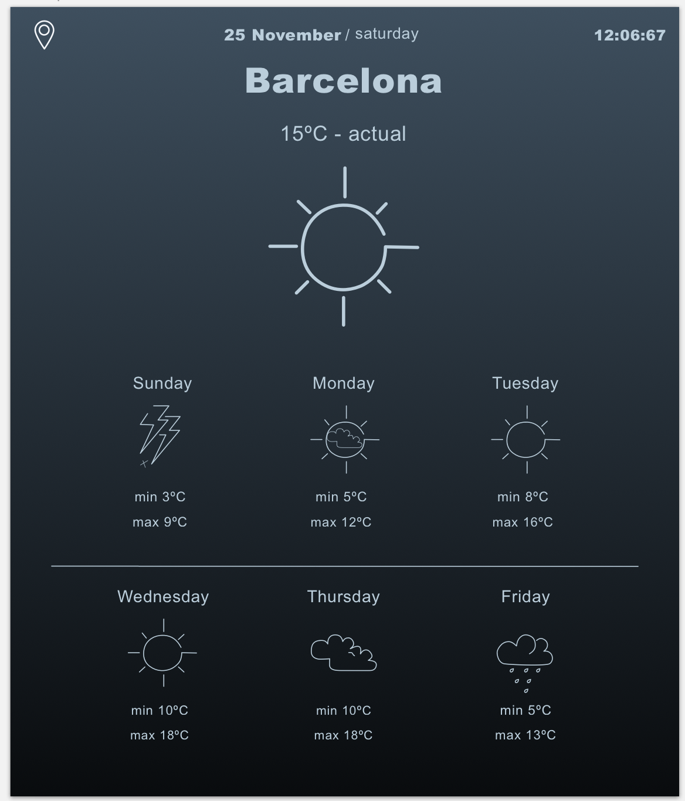
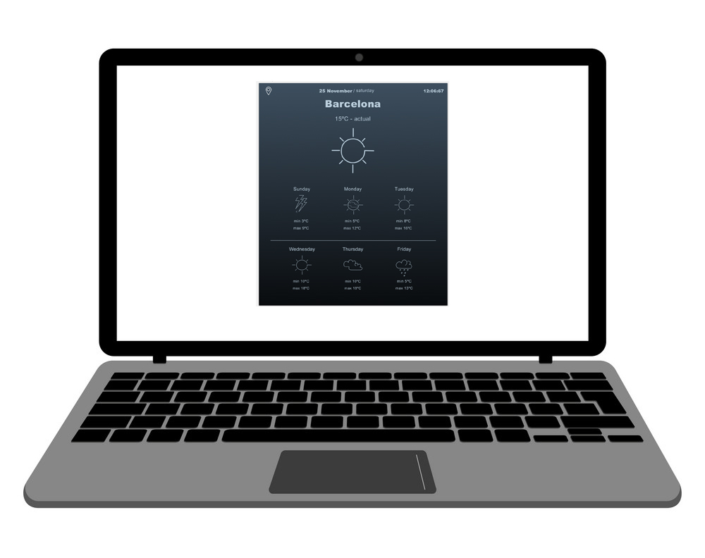
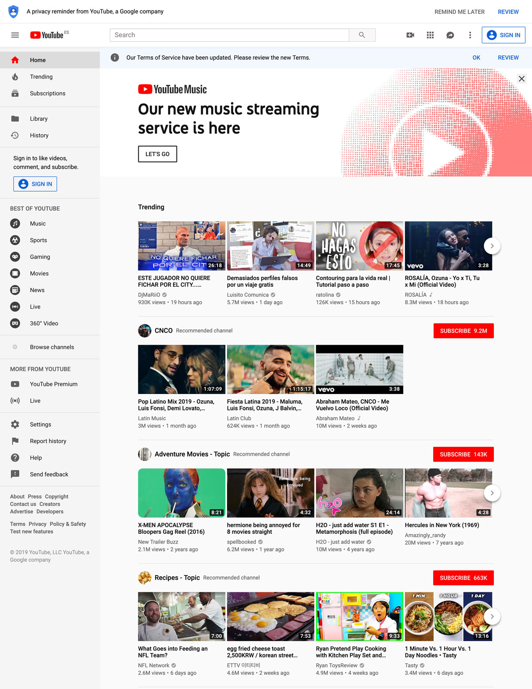

# Cloning Projects

> Cloning implies recreating the layout with HTML and CSS, no functionality. Try to stay away from the libraries like Bootstrap, just go with the CSS Grid or Flexbox.

Cloning projects are to be pushed to GitLab for us to see and give feedback.

These HTML/CSS projects will help you to practice using CSS for all kinds of layout.

Please take the `01_html_css` folder outside of you `BCS_JS_BOOTCAMP_FILES_TDD` to not have nested git projects. And then you will have 6 folders for 6 cloning projects, each would be initialized as git. Do commits often and push your code to gitlab/github so we can see the result, progress and give feedback.

Please start with HTML only first, feel free to refer to the [HTML reference page](./js_cur/_html/HTML5) and CSS section where every block has it's own video lesson.

---

<details>
    <summary>🎬 Video: HTML and CSS intro</summary><div class='video-container'>
        <iframe src="https://www.youtube.com/embed/VttwpumXIKQ?rel=0" frameborder="0" allow="accelerometer; autoplay; encrypted-media; gyroscope; picture-in-picture" allowfullscreen ></iframe></div>
</details>

This video is describing the introductory HTML/CSS concepts, if you did the HTML/CSS part of the pre-course properly feel free to skip it, otherwise it is strongly recommended to watch it.

---

<details>
    <summary>🎬 Video: HTML and CSS workflow with example cloning portfolio page</summary><div class='video-container'>
        <iframe src="https://www.youtube.com/embed/TZtFi147BMI?rel=0" frameborder="0" allow="accelerometer; autoplay; encrypted-media; gyroscope; picture-in-picture" allowfullscreen ></iframe></div>
</details>

This video is following the process of creating a clone of a portfolio page from scratch and might help you to understand how to "see" the structure of the page just by looking at it. Recommended to watch if you are not quite sure how to complete a project from start to finish.

---

<details>
    <summary>🎬 Intro to using terminal</summary><div class='video-container'>
        <iframe src="https://www.youtube.com/embed/ve8Ui2LMpjs?rel=0" frameborder="0" allow="accelerometer; autoplay; encrypted-media; gyroscope; picture-in-picture" allowfullscreen ></iframe></div>
</details>

This video will help you to get familiar with using Terminal to work with the file system, i.e. how to create/remove/move files and folders and navigate through your file system via the command line.

<details>
    <summary>Mac/Linux/GitBash most used terminal commands</summary>

To go to some folder:

    cd path_to_a_target_directory_(folder)

To go one level up in the folder hierarchy:

    cd ..

To see a list of folders and files in the current folder:

    ls

And to see them with hidden folders/files run

    ls -a

To create a new folder:

    mkdir name_of_a_new_folder

To create a new file in the current folder:

    touch filename

To remove a file:

    rm filename

To remove a folder:

    rm -rf folder_name

To find and remove specific instances of folders inside current folder:

    rm -rf `find . -type d -name folder_name`

or

    find . -name NAME_OF_A_FOLDER -exec rm -rf {} \;

</details>

---

<details>
    <summary>🎬 Video: using git and gitlab/github</summary><div class='video-container'>
        <iframe width="560" height="315" src="https://www.youtube.com/embed/22dZIZ1YUBo?rel=0" frameborder="0" allow="accelerometer; autoplay; encrypted-media; gyroscope; picture-in-picture" allowfullscreen></iframe></div>
</details>

This video is explaining how to use git and GitLab to initialize git project, push and pull files to GitLab, keep version control with commits, switch between them, resolve conflicts.

---

### Some of the royalty-free images sources you can use:

* https://unsplash.com/
* https://pixabay.com
* https://picsum.photos

---

## Cloning Project #1

**Create a single-page responsive website with the following elements (the content could be anything, just the layout should be the same):**

-   [👉 Take a look at the example of such a website 👈](https://res.cloudinary.com/gk3000/image/upload/v1572367458/single-page-workshop_barcelona-code-school.jpg), it's one page which takes the full width of the screen
-   Navigation on top with links to different section of the same webpage
-   Header section with image background and Title, Subtitle and Call to action element on top of it
-   Contact us section with embedded Google Map
-   Responsive image gallery with images resizing/reorganizing based on the width of the screen
-   Brands section which is a responsive grid of images with text below each one
-   Team section with portraits and captions for the team members
-   Footer section
-   Take a look at the [example of pure CSS dropdown menu](https://codepen.io/GK3000/pen/eYOeVWM)
-   A video example of the original website to be cloned: https://www.youtube.com/watch?v=iMRaRBrJpbA

> It's a good idea to create a git repo for your cloning projects and start committing/pushing the progress to GitLab.
> [Git version control and GitHub repository](js_cur/_javascript/Git-version-control-and-GitHub-repository.md)

<details>
    <summary>🎬 Video: cloning project first steps -- git and GitLab workflow</summary><div class='video-container'>
        <iframe width="560" height="315" src="https://www.youtube.com/embed/n-dnhy86OvY?rel=0" frameborder="0" allow="accelerometer; autoplay; encrypted-media; gyroscope; picture-in-picture" allowfullscreen></iframe></div>
</details>

---

## Cloning Project #2

**Refactor previous project to make it a multi-page website**

-   Make every section of the webpage to be a separate page (a separate HTML file), so you will have something like:

    * index.html with the home page (the splash screen)
    * location.html with the Location section and a map
    * team.html with images of the team
    * brands.html with the content of the brands section
    * gallery.html with the gallery images

-   Every page should have the topbar with navigation and the footer
-   Here is an example of what it should look like: http://dear-beer-w-pages.surge.sh/

You don’t need to create any functionality, just purely presentational copy of all the page elements.

---

## Portfolio page

> This portfolio page could be used for actual job hunt after the course and eventually you will fill it up with the projects you will do during the bootcamp. If you are not looking into getting a developer's job or already have a portfolio page you are going to use feel free to skip to the next cloning project.

Examples of portfolios done by our previous students:

http://josharnott.surge.sh

http://annachew.surge.sh

https://yenhoang_portfolio.surge.sh/

https://saramoya.gitlab.io/my-portfolio/

http://gerviebarczyk.com/

https://gabriellatavares.surge.sh/

The visual design is completely up to you.

Make sure to include the meta tags into the `<head>` section to be displayed in the browser tab and if shared on any social platforms.

```html
<head>
    <meta charset="UTF-8" />
    <meta name="viewport" content="width=device-width, initial-scale=1.0" />
    <link rel="stylesheet" type="text/css" href="style.css" />
    <!-- ↓↓↓ title, description, author name, keywords, og preview tags ↓↓↓ -->
    <title>My first website</title>
    <meta name="description" content="My first website" />
    <meta name="author" content="GK" />
    <meta
        name="keywords"
        content="developer, fullstack, javascript developer, web and mobile developer portfolio, fullstack developer"
    />
    <link rel="shortcut icon" href="./images/favicon.png" type="image/x-icon" />
    <meta property="og:title" content="GK portfolio page" />
    <meta
        property="og:description"
        content="JavaScript Full-Stack Developer portfolio page with projects, contact information, experience and hourly rates"
    />
    <meta
        property="og:image"
        content="http://gk3000-portfolio.surge.sh/images/gk3000.jpg"
    />
    <meta property="og:url" content="http://gk3000-portfolio.surge.sh" />
    <meta name="twitter:card" content="summary_large_image" />
</head>
```

We suggest to use <a href='https://gk3000.gitlab.io/js_curriculum/#/js_cur/_html/Hosting-with-surge'>`surge`</a> for publishing your portfolio page

---

## Cloning Project #3: Lights Out Challenge

**Weather app clone (static page, no functionality)**

The goal of this exercise is to focus on understanding the structure and planning the HTML first before coding. To do so, try to recreate this page without checking the results in the browser before completing it. 

First analyze the screenshot and decide on the structure and CSS solution to position elements where they supposed to be. Then add the HTML code for the layout and apply CSS. Remember to link your CSS file to your HTML file. 

Here is is the repo to use as a boilerplate with the icons: https://gitlab.com/gk3000/light_out_weather_app. To get it first click the "Fork" button to copy it into your GitLab account and then clone it to your laptop by selecting "Clone" button --> copy the URL and in the Terminal run `git clone URL_YOU_COPIED`. This will download all the files and to push it back once done you will need to run only these 3 commands:
```bash
git add .
git commit -m 'done'
git push
```

> Make the main container for this page with limited set width of 600px so it will not stretch across the screen.




---

## Cloning Project #4

[NY Times desktop website clone](https://www.nytimes.com/)

Only the desktop version.

---

## Cloning Project #5

Trello board clone

Only the desktop version exactly as seen in the screenshot.


---

## Cloning Project #6

Whatsapp clone

Only the desktop version exactly as seen in the screenshot.


---

## Cloning Project #7

Youtube clone

