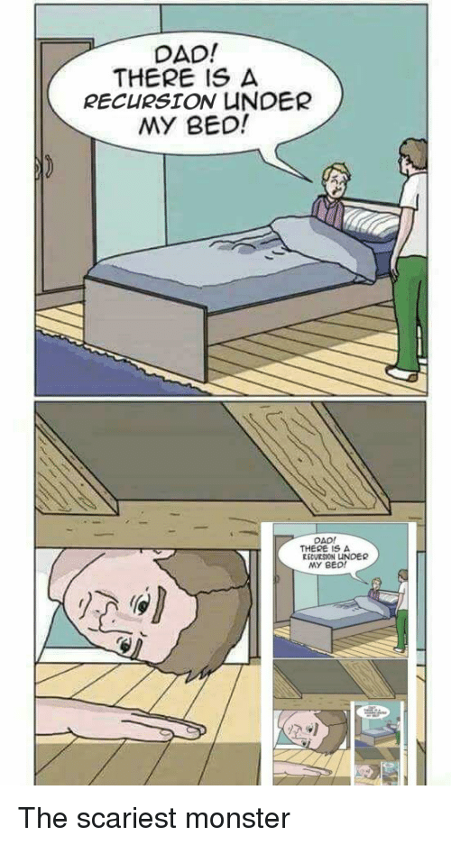

# Block 08: Debugger, Scope, Recursion

---

<details>
    <summary>🎬 Video: closures, recursion</summary><div class='video-container'>
        <iframe width="560" height="315" src="https://www.youtube.com/embed/hOnLq-GQQqE?rel=0" frameborder="0" allow="accelerometer; autoplay; encrypted-media; gyroscope; picture-in-picture" allowfullscreen></iframe></div>
</details>

---

<details>
    <summary>🎬 Video: debugger, scope, array methods</summary><div class='video-container'>
        <iframe width="560" height="315" src="https://www.youtube.com/embed/kEceH4UXtH0?rel=0" frameborder="0" allow="accelerometer; autoplay; encrypted-media; gyroscope; picture-in-picture" allowfullscreen></iframe></div>
</details>

---

## Debugger

<!--  -->


The debugger is a super useful tool available in the Dev Tools that allows us to stop the execution of our code and verify which values our variables hold at that given time.

This way we don’t need to `console.log` every single thing we may need to know the value of, as we can check them individually while in the debugger.

To use the debugger all we need to do is to add the keyword `debugger` in whichever part of our code we want our execution to stop.

```javascript
var game = (news) => { 
        var attempts = 2;
        var gameOver = false;
        return function (attempts, gameOver ) {
                debugger
                if(news == "bad news") {
                        attempts = 0
                }
                debugger
                if(attempts < 1) {
                        gameOver = true
                }
                debugger
        }(attempts, gameOver )
}
game("bad news")
```


<!--  -->

 

<!--  -->

 


In the above example we can see how the value of our variables changes and how this is shown in debugger mode.

There are 2 buttons in the debugger “player”: the *play* button and the *round arrow*.

<!--  -->

 

The play button will **resume the execution** when clicked and the round arrow button will **step over next function called**.

In other words the round arrow

<!--  -->

 

will run your code line by line each time you press it. 

The play button 

<!--  -->

 

will resume the execution and stop it again at the next debugger if you have any.

## Scope

JavaScript has two scopes – global and local. Any variable declared outside of a function belongs to the global scope, and is therefore accessible from anywhere in your code. 

Each function has its own scope, and any variable declared within that function is only accessible from that function and any nested functions.

```javascript
var age = 19
var name ="Jason"

var tell = () => {
    var secret = "super mega secret"
    console.log(`Mr.${name} is ${age} years old`)
}

console.log(secret)
//Uncaught ReferenceError: secret is not defined
tell()
// Mr.Jason is 19 years old
```

As shown in the above example the function `tell` has access to the variables declared outside the function (in the **global scope**), however the “outside world” has no access to the **local scope**.

In case we omit the keyword `var` in the variable declaration the variable unless already declared will be made **global** and therefore will be available in the global scope (except if a variable is declared inside the function, then it will still belong to this function's scope). 

>Please note that this is very bad practice and should be avoided at all costs, it will likely lead to annoying issues when debugging.

## Recursion

> In order to understand recursion, one must first understand recursion

A recursive function is a function that calls itself until it's done. They can be useful when we require them to call themselves for an unknown number of times.

<!--  -->


An example of a recursive function that counts down from number until it reaches 0:

```javascript
function recursivePrint(string, numberOfTimes) { 
if(numberOfTimes > 0) {
console.log(string);
recursivePrint(string, numberOfTimes - 1);}
}
recursivePrint('I love recursion', 5)
//I love recursion
//I love recursion
//I love recursion
//I love recursion
//I love recursion
```

Check out how we've called the function within itself with -1 `numberOfTimes` value.

Now simple `while`loop

```javascript
var counter = 10;
while(counter > 0) {
console.log(counter--);
}
```

Could be rewritten with recursion:

```javascript    
var countdown = function(value) {
if (value > 0) {
console.log(value);
return countdown(value - 1);
} else {
return value;
}
};
countdown(10);
```
A simple use of recursion would be to access a deply nested element in an uknon depth of arrays.

```javascript

function flatten (arr) {
    if(Array.isArray(arr)) {
        for (var ele of  arr) {
            return flatten(ele)
        }
    }
    return arr;
}
var secret = [[[[[[[[[[[['got me!']]]]]]]]]]]]
flatten(secret)
//"got me!"
```

Another handy way tp use recursive function would be to assign a *named* function expression to a variable and then call this variable with () initially and from the assigned function call the named function expression recursively:

```js
var bar = function foo() {
// foo() is available from here
};

// foo is not available from here, but bar is
bar()
```

```js
var bar = function foo(a) {
a--
console.log(a)
return a>0 ? foo(a) : a 
};

bar(5)
```

# Exercise time!
