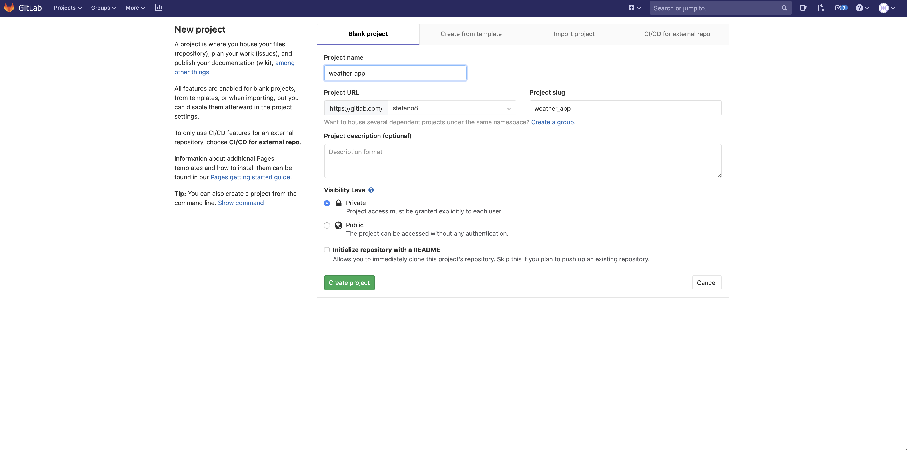
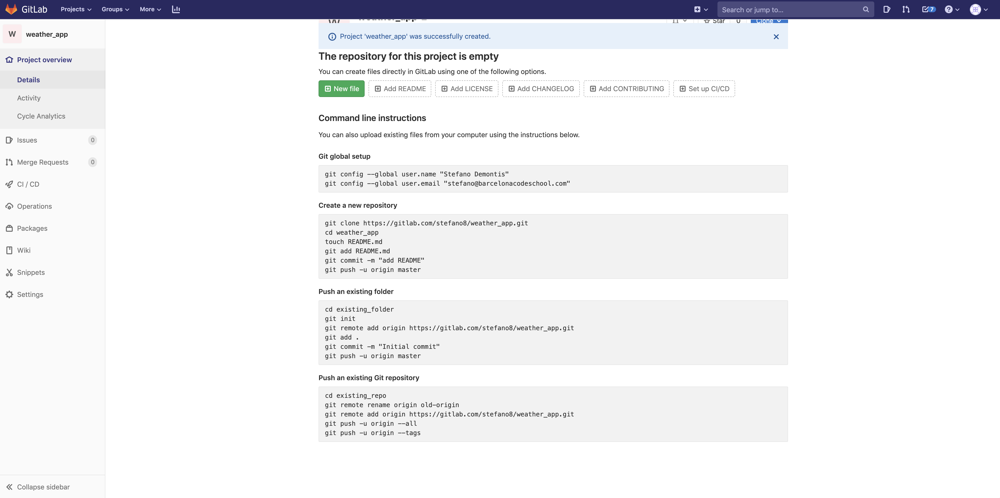

# Git version control and GitHub repository.

---

    
🎬 Video: using git and gitlab/github

        <iframe width="560" height="315" src="https://www.youtube.com/embed/22dZIZ1YUBo?rel=0" frameborder="0" allow="accelerometer; autoplay; encrypted-media; gyroscope; picture-in-picture" allowfullscreen></iframe>

---

> Once you have Git installed in your Terminal (Mac) or GitBash (Windows) run `git config --global init.defaultBranch main` to set up the default branch to `main`, [here is why](https://barcelonacodeschool.com/changing-default-git-branch-to-main)

In order for us to use a git version control tool we first need to install git.

You can download the installer from the below links:

## Mac OSX

https://git-scm.com/download/mac

If you have [home-brew](https://brew.sh) installed you can install git from the **terminal**

`brew install git`

## Windows

https://git-scm.com/download/win

## Version control repository

Now that you have git installed you can choose a **version control repository,** there are plenty to choose from, some of the most popular being Github, GitLab, Bitbucket.

Github is the most popular among all of them and is de facto a standard for hosting your repos, but it has the downside of not allowing any free private repos, so if you use the github free account all your work will be publicly available (which is fine while you are learning), almost all other version control repository allow some free private repos.

You can choose to use the one you like as the syntax to use them is virtually identical.

Once you have created an account you need to create a repo, you will need a  different one for each project you will work on.

You can create a repo from the UI of the site that you choose.

Here is how it looks like in GitHub but it won’t be much different in Bitbucket or Gitlab

<!--  -->

<!--  -->

Once the repo is created you can make your first commit running the following commands in the terminal in the location where your project is.

so first of all `cd` `'``YOUR_PROJECT_FOLDER``'`

then the first command you need to type is

    git init

this will initialize your git project.

Then you need to link your project to the remote repo you created with the following command:

    git remote add origin "YOUR_REPO_URL_GOES_HERE"

Now add all the files and folders of your project for the next commit:

    git add .

add the changes to the git project

    git add -A

 only adds files modified after last commit

Create a commit itself. Commit is like a checkpoint in the process of development which saves entire state of your project and let’s you get back to it (i.e. restore the state of you code):

    git commit -m 'your message goes here!!!'

commit the changes.

Next you can push entire project to the remote repo, i.e. upload your project to GitHub:

    git push -u origin main

pushes the changes.

you need to use -u origin main only for the first time, after that it will just be git push.

These  commands are the most common ones, and if you are working alone these are almost the only ones you will need.

	git remote -v 
Is an easy way to check remote url in case you are in doubts

## Displaying the history of commits in a local project

`git log --all --decorate --oneline --graph`

## Creating GitHub repo from the terminal

`curl -u USER https://api.github.com/user/repos -d '{ "name": "REPO" }'`

Where USER is your GitHub username and REPO is the name of the new repository you want to create. 

## Git cheatsheet:

`git add -A `
only stages changed files for the commit

`git log --oneline` 
show history of commits

`git branch`
show branches

`git branch namebranch`
creates new branch

`git checkout branchname`
switch to another branch

`git checkout -b branchname`
create and checkout new branch

`git merge branchname`
merges branchname into the current branch

`git branch -d namebranch`
deletes a namebranch branch

`git stash`
save changes since last commit in .git folder but it's not a commit, for example if we have not finihed working on the feature but had had to checkout another branch for some ugent situation. It also hides stashed changes so they are not crashing your app for example

`git stash apply`
brings back files stashed before and makes them visible and available

`git diff`
show differences between current files and last commit 

`git blame nameoffile`
shows last commits and by who

`git log commitID -p`
shows full info on specific commit

`git tag somethin`
adds a tag to current commit, like a version, v1.0.0, major.minor.patch

`git push --tags`
add tags to remote repo

`git tag -a v2.0.1`
adds tag with desc of it

## git rebase 

If we have several local commits and we wantto combine them together

`git fetch`
`git rebase -i origin/main`

Then in editor we select how to rebase 

and then
`git push`

`git bisect`
to find the initial commit with a bug

### globally ignoring some files/folders:

go to root:
`cd ~`
`touch .gitignore_global`
then run 
`git config --global core.excludefiles ~/.gitignore_global`

# Practicing

https://learngitbranching.js.org

