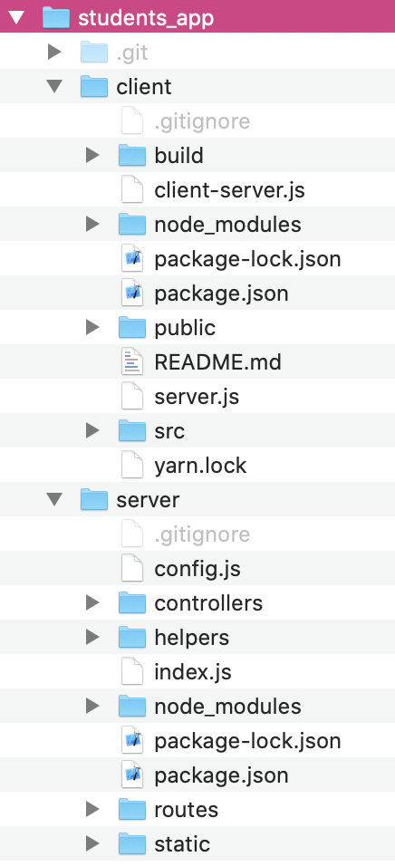

# Deploying full-stack app on Heroku

---

<!-- <details>
    <summary>🎬 Deploying your app with Digital Ocean</summary><div class='video-container'>
        <iframe width="560" height="315" src="https://www.youtube.com/embed/IIqYjklZLMM?rel=0" frameborder="0" allow="accelerometer; autoplay; encrypted-media; gyroscope; picture-in-picture" allowfullscreen></iframe></div>
</details> -->

---

In this guide we are assuming the structure of your app is:
```
    -- root project folder with git intialized (if not run `git init`)
	   -- "client" folder
	   -- "server" folder 
```
## Preparing your server to serve the optimized production build of your client

Now as we are entering the production mode we do not want to run our clients with development mode `npm start` on live server, instead we are going to make a production build and serve it instead with our main back-end express server. 

(LOCALLY) In your main back-end file (such as `server.js` or `index.js` whatever you named it) add these code:

```javascript
const express = require('express');
const app = express();
const path = require('path');

app.use(express.static(__dirname));
app.use(express.static(path.join(__dirname, '../client/build')));

app.get('/*', function (req, res) {
  res.sendFile(path.join(__dirname, '../client/build', 'index.html'));
});
``` 

Please keep in mind that the path to your `build` folder should be your relative path from the main entry file of your server to the location of client. So if the structure of your project is like this:



then the path from main server file `index.js` to the `build` folder would be `../client/build`


1. Install Heroku CLI if it's not installed yet: https://devcenter.heroku.com/articles/getting-started-with-nodejs#set-up 

## In the server's folder:

2. In the server's root folder check that `package.json` file has `"main": "index.js"` pointing to your main server file. So if you main file is index.js then it will be `"main": "index.js"`, if your main file is called server.js it should be `"main": "server.js"`, etc.

3. Add script `"start": "node index.js"` (provided your main server file is called `index.js`) into the `scripts` section of package.json it so it will look like this:

```javascript
  "scripts": {
    "test": "echo \"Error: no test specified\" && exit 1",
    "start": "node index.js"
  },
```

4. Specify node engine version according to the version you have locally (you can check it form the terminal with `node -v` command). So for example in case you have version 16 add this to your `package.json`:

```javascript
  "engines": {
    "node": "16.x"
  },
```
Now your `package.json` file will look something like this:
```json
{
  "name": "multylang",
  "version": "1.0.0",
  "description": "",
  "main": "index.js",
  "scripts": {
    "test": "echo \"Error: no test specified\" && exit 1",
    "start": "node index.js"
  },
  "engines": {
    "node": "16.x"
  },
  "author": "",
  "license": "ISC",
  "dependencies": {
    "body-parser": "^1.19.0",
    "cors": "^2.8.5",
    "express": "^4.17.1"
  }
}
```

5. Make sure that you use port evironment variable for the port number of your server to run at:

```javascript
let port = process.env.PORT || 3030
app.listen(port, () => console.log(`I am on port ${port}`))
```

6. From the server folder run `npm i cors` and add this to your main server file:

```javascript 
let cors = require('cors')
app.use(cors())
```

7. Delete any `package-lock.json` or `yarn.lock` files you might have. 

8. Now create a new file `package.json` in the root of your project so that it will be:
```
    -- root project folder with git intialized (if not run `git init`)
        -- "client" folder
        -- "server" folder 
        -- package.json
```

and copy all the content of your server's package.json there. Modify line with `start` script by adding `cd ./server &&` there.

If you've had 
`    "start": "node index.js"`
make it 
`    "start": "cd ./server && node index.js"`

### In the client's folder:

9. Now from the client run `npm build` 

10. Run `rm -rf .git`

11. Open file .gitignore and delete line `/build`

### In the server:

12. Run `npm start` from the server, you app should be live at localhost with the **port number of you server**.

13. Stop the app. 

### In the root folder of the project:

14. Create an account at heroku.com if you do not have it yet. 

15. In the terminal from the root folder of your project run `heroku login` and login in the browser to your heroku account.

Delete any `package-lock.json` or `yarn.lock` files you might have in the client and/or server and `node_modules` folder in your server.

Run:
```
git add .
git commit -m "heroku deploy"
```

16. Run `heroku create`

17. Go to your heroku.com dashboard and click on the newly created app. Go to Settings and scroll down to Domains. You will see url for this app. Copy it. 

## Now we need to prepare client to be able to access server not at localhost but at heroku url you just copied.

Either manually replace you localhost url to your heroku's app url for all the requests from client to server or use this approach: 

A. In your *client* folder create a `config.js` file with the following content where http://localhost:3030 is you port number and `url_of_your_heroku_app` is the url of your heroku app:

```
const URL = window.location.hostname === `localhost`
            ? `http://localhost:3030`
            : `http://url_of_your_heroku_app`
            
export { URL }
```
B. Anywhere you need to send a request from your client to your server do this:

```
import { URL } from '../config'
```

And in requests themselves use something like

```
await Axios.post(`${URL}/products/addone`,{product1})...
```

So that the request from your client will go to localhost if it's running locally or to your actual server if it's running remotely.

**Create a new production build again in the client with `npm run build` if you did any changes in your client's code, like replacing URL**

Now continue with deployment 👇

18. In the browser in the dashboard of heroku click on your newly created app and go to the "Deploy" section. 

19. Scroll down to the "Deploy using Heroku Git" section to the line similar to `heroku git:remote -a murmuring-sea-91732` there `murmuring-sea-91732` would be the name of your app. 

20. Run this line in the terminal like  
```
heroku git:remote -a murmuring-sea-91732
```

21. Run these commands one by one from the root folder of your project: 
```bash
git add .
git commit -m "pushing to heroku"
git push heroku main
``` 

> If your current branch is 'master' then run `git push heroku master` instead of the last command

22. Wait for the code in the terminal to finish and you will see url with your server deployed. Go to this url and start using your server 🤘👍🚀

### Updating the deployed app

1. If you've made changes to the client run `npm run build` from the client folder 

2. In the server folder remove `node_modules` folder if it is there.

3. From the root folder of the project:

```bash
git add .
git commit -m "heroku deploy"
git push heroku main
```

> If you will be prompted to login to heroku run `heroku login`
