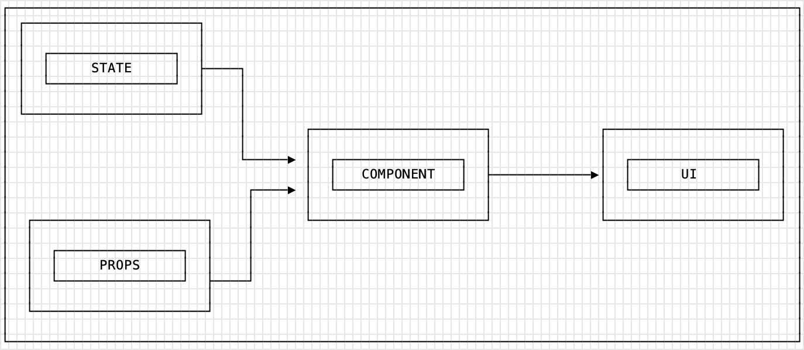

# What are React Props?

---

<details>
    <summary>🎬 Video: React -- components, props, classes</summary><div class='video-container'>
        <iframe src="https://www.youtube.com/embed/FHtSFSnSj2M?rel=0" frameborder="0" allow="accelerometer; autoplay; encrypted-media; gyroscope; picture-in-picture" allowfullscreen ></iframe></div>
</details>

---

Sample code from the video lesson:

<iframe src="https://codesandbox.io/embed/props-and-classes-ktkn7?fontsize=14&hidenavigation=1&theme=dark"
     style="width:100%; height:500px; border:0; border-radius: 4px; overflow:hidden;"
     title="props-and-classes"
     allow="accelerometer; ambient-light-sensor; camera; encrypted-media; geolocation; gyroscope; hid; microphone; midi; payment; usb; vr; xr-spatial-tracking"
     sandbox="allow-forms allow-modals allow-popups allow-presentation allow-same-origin allow-scripts"
   ></iframe>

---

When you use any React component you can pass it some input data that you want it to work with. 

These properties are called "props" and are read-only values that define the basic starting point for a component.

Props are a way of passing data from parent to child. That's it. In essence, props are just a communication channel between components, 
always moving from top (parent) to bottom (child).

<!--  -->


## Example of props

Your parent component:

```javascript
import React from 'react';
//require React 

import Child from './Child'
// require child component from the file

const App = () => {
//Create a React class called App

    const fruit = 'Banana'

    return  <div className="App">
               <Child fruit={fruit}/>
               {/* we are sending banana as a prop to our child comp */}
            </div> 
  }
}
export default App; //Export your component
```

Your child component:

```javascript
import React from 'react'

const Child = (props) => {
    console.log(props)
    // banana is available here
    // you can see that props is an object
    let { fruit } = props
    // and we can use destructuring 
    return <h1>My favourite fruit is {props.fruit}. I adore {fruit}s</h1>
    // and we render it   
}
export default Child
```

  <iframe src="https://codesandbox.io/embed/react-block-2-1-forked-ootbb?fontsize=14" title="React Block 2 - 1" allow="geolocation; microphone; camera; midi; vr; accelerometer; gyroscope; payment; ambient-light-sensor; encrypted-media" style="width:100%; height:500px; border:0; border-radius: 4px; overflow:hidden;" sandbox="allow-modals allow-forms allow-popups allow-scripts allow-same-origin"></iframe>


## Default props

The defaultProps method assign a value to props if they are not passed from a parent component.

```javascript
  Child.defaultProps = {
    names : ['Francesca','Luisa','Giuseppina']
  }
```

Let's suppose that we have a parent and a child component and we want to pass an array of names by props from parent to child.

We also want to loop in the child component to render each name in an h1.

If a certain point the names array become undefined it will crush our app.

We can solve it using the defaultProps method like in the example.

```javascript
import React from 'react';
import Child from './Child'

const App = () => {

    return <div>
              <Child/>
           </div>

}
export default App;
```

```javascript
import React from 'react'

const Child = (props) => {
    console.log(props)
    return <div>
            {
              props.names.map( (ele,i) => <h1 key={i}>{ele}</h1>)
            }
          </div>
    
}
export default Child

Child.defaultProps = {
  names : ['Francesca','Luisa','Giuseppina']
}
```

  <iframe src="https://codesandbox.io/embed/react-block-2-2-forked-nnh08?fontsize=14" title="React Block 2 - 2" allow="geolocation; microphone; camera; midi; vr; accelerometer; gyroscope; payment; ambient-light-sensor; encrypted-media" style="width:100%; height:500px; border:0; border-radius: 4px; overflow:hidden;" sandbox="allow-modals allow-forms allow-popups allow-scripts allow-same-origin"></iframe>


Default props could be useful in case your child component is expecting some data passed via props but they might or might not arrive. Or with asynchronous request to fetch data to be passed later via props initially the props object would be empty and if you are let's say looping on the array which is expected to come via props you might have an error since there is no data yet. 

Consider the following example: 

```javascript
import React from 'react';
import Child from './Child'

const App = () => {

    let productsList = // fetching data from the server with async call; it will take a moment for data to arrive

    return <div>
              <Child products={productsList}/>
           </div>

}
export default App;
```

```javascript
import React from 'react'

const Child = (props) => {

    return <div>
            {
              props.products.map( (ele,i) => <h1 key={i}>{ele}</h1>)
            }
          </div>
    
}
export default Child

Child.defaultProps = {
  products : []
}
```

Before `productsList` would be received from the server it will be passed as undefined via props to child which will break our `.map` method. But with default props in child it will not break, simply loop on the empty array rendering nothing. Then after we will have response from the server with data Child will be re-rendered with updated props and it will map through the products nicely. 

Another solution for this would be to use optional chaining `?.` which will prevent `.map` throwing error if `props.products` will be undefined initially:

```javascript
import React from 'react';
import Child from './Child'

const App = () => {

    let productsList = // fetching data from the server with async call; it will take a moment for data to arrive

    return <div>
              <Child products={productsList}/>
           </div>

}
export default App;
```

```javascript
import React from 'react'

const Child = (props) => {

    return <div>
            {
              props.products?.map( (ele,i) => <h1 key={i}>{ele}</h1>)
            }
          </div>
    
}
export default Child

// Child.defaultProps = {
//   products : []
// }
```

## Checking props type

React has some built-in typechecking abilities. To run typechecking on the props for a component, you can assign the special propTypes property:

```javascript
import PropTypes from 'prop-types';

class Greeting extends React.Component {
  render() {
    return (
      <h1>Hello, {this.props.name}</h1>
    );
  }
}

Greeting.propTypes = {
  name: PropTypes.string
};
```

For the full list of features and prop types please see the documentation: https://www.npmjs.com/package/prop-types

<iframe
     src="https://codesandbox.io/embed/react-block-2-1-04cqn?expandDevTools=1&fontsize=14&hidenavigation=1&theme=dark"
     style="width:100%; height:500px; border:0; border-radius: 4px; overflow:hidden;"
     title="React Block 2 - PropTypes"
     allow="geolocation; microphone; camera; midi; vr; accelerometer; gyroscope; payment; ambient-light-sensor; encrypted-media; usb"
     sandbox="allow-modals allow-forms allow-popups allow-scripts allow-same-origin"
   ></iframe>

## Class components

In alternative to function components we can opt for a class-based component. 

> Starting from React v16.8.0 when hooks were introduced we prefer to use function components. Before that function components could not use state and lifecycle methods and they were pretty simple "dumb" components. Starting from v16.8.0 the vector changed towards using function components since they are easier to write and read and now can do everything class components can. Since there is still a huge number of apps already written with class components you have to learn both -- class and function components. For the new projects generally speaking you would normally go with function components.

The syntax for the class components is a bit different, in one case we have a JavaScript function in the other an es6 class.

```javascript
import React from 'react';
//require React 

class App extends React.Component {
//Create a React class called App

  render() {
  //render function

    var myName ='Antonello' 
    //make sure you defined your variable outside the return

    return (
    //ALL that you display needs to be inside your return
      <div className="App">
      {/*render a DIV with a h2 inside*/}

        <h2>Welcome to React from {myName}</h2>
       {/* In curly braces we execute ANY valid JS */}
      
      </div>
    );
  }
}
export default App; //Export your component
```

- Import React
- Create a React class component
- Declare the render function (here is where we are going to return all the content of our app)
- Export the component


Let's see how to pass props between two class based components.

```javascript
import React from 'react';
import Child from './Child'

class App extends React.Component {
  render(){
    return (
      <div>
         <Child names={['Francesca','Luisa','Giuseppina']}/>
      </div>
    )
  }
}
export default App;
```

```javascript
import React from 'react'

class Child extends React.Component{
    
  render(){
    console.log(this.props)
    return (
      <div>
            {
              this.props.names.map( (ele,i) => <h1 key={i}>{ele}</h1>)
            }
          </div>
    )
  }
}
export default Child
```

We pass the same way as we did in the function component, but we retrieve the props object by this.props.

  <iframe src="https://codesandbox.io/embed/react-block-2-3-forked-j0wyl?fontsize=14" title="React Block 2 - 3" allow="geolocation; microphone; camera; midi; vr; accelerometer; gyroscope; payment; ambient-light-sensor; encrypted-media" style="width:100%; height:500px; border:0; border-radius: 4px; overflow:hidden;" sandbox="allow-modals allow-forms allow-popups allow-scripts allow-same-origin"></iframe>

The default props here are inside the class and preceded by the keyword static.

```javascript
  static defaultProps = {
    names : ['Francesca','Luisa','Giuseppina']
  }
```

```javascript
import React from 'react';
import Child from './Child'

class App extends React.Component {
  render(){
    return (
      <div className="App">
         <Child />
      </div>
    )
  }
}
export default App;
```

```javascript
import React from 'react'

class Child extends React.Component{

  static defaultProps = {
      names : ['Francesca','Luisa','Giuseppina']
  }
    
  render(){
    console.log(this.props)
    return (
      <div>
            {
              this.props.names.map( (ele,i) => <h1 key={i}>{ele}</h1>)
            }
          </div>
    )
  }
}
export default Child
```
  <iframe src="https://codesandbox.io/embed/react-block-2-4-forked-9fyhy?fontsize=14" title="React Block 2 - 4" allow="geolocation; microphone; camera; midi; vr; accelerometer; gyroscope; payment; ambient-light-sensor; encrypted-media" style="width:100%; height:500px; border:0; border-radius: 4px; overflow:hidden;" sandbox="allow-modals allow-forms allow-popups allow-scripts allow-same-origin"></iframe>

  ---

### Setting base URL for importing components

To make imports of components easier and avoid using relative paths there is an easy solution:

1. Create a file called `jsconfig.json` in the root folder of react project (where you have your `package.json` file).
2. Add base URL which is your `src` folder in this file:
```json
{
"compilerOptions": {
 "baseUrl": "src"
},
"include": ["src"]
}
```
3. Now instead of using relative paths like `../../components/footer` you can simply use `components/footer` doesn't matter if you import them from the files nested within other folders inside your `src`, the paths can start directly with folder/file name right in the `src`. So if you have for example this structure:

```
-src 

---components 

------elements 

---------Footer.js 

---forms 

------Signup.js 
```

and you want to import `Signup.js` in the `Footer.js` instead of 

`import Signup from "../../forms/Signup.js"` 

you will be able to do simply 

`import Signup from "forms/Signup.js"` 

because all the paths can start from the base URL we defined in `jsconfig.json` and it is `src` folder in this example.

