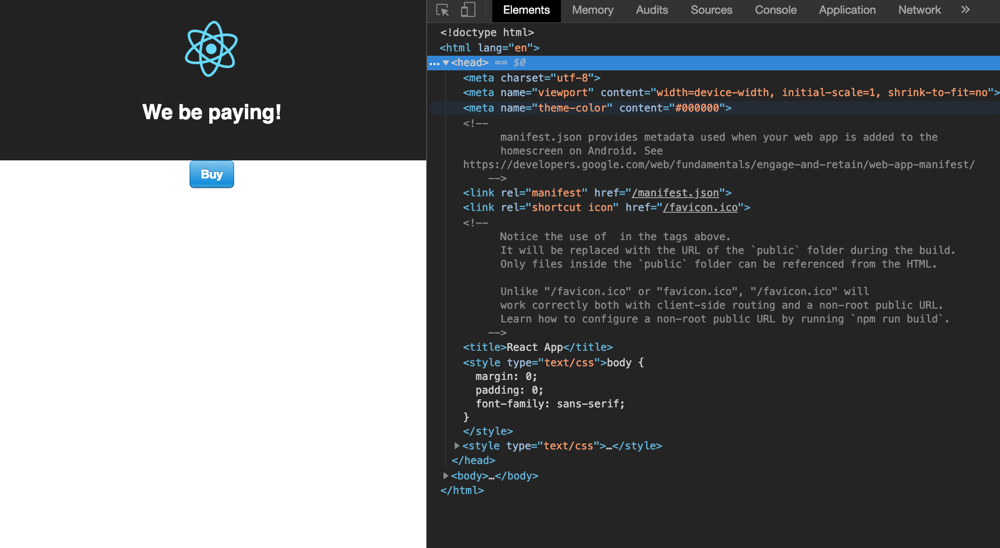
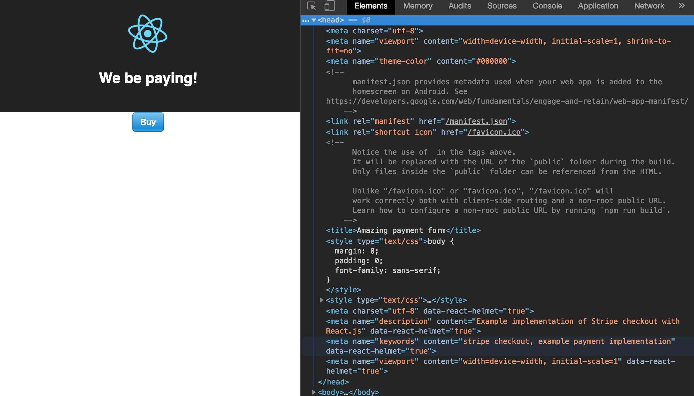

# React 07: React Helmet

## Adding meta data for SEO

----------

So far all of your apps do not have one crucial part -- meta section with SEO data like title, description and keywords. 

Let's fix it by adding React Helmet to our apps. 

This one doesn't have these metadata as we can see in the inspector:

<!--  -->


Install React Helmet for your client app:

npm install --save react-helmet


Then in your page (starting with homepage) import it:

import {Helmet} from "react-helmet";

And now we can have our own custom meta tags with appropriate content:

<!-- tabs:start -->
#### **Class components**
```javascript
class App extends Component {
  render() {
    return (
      <div className="App">

      <Helmet>
      <title>Amazing payment form</title>
      <meta charSet="utf-8" />
      <meta name="description" content="Example implementation of Stripe checkout with React.js" />
      <meta name='keywords' content='stripe checkout, example payment implementation'/>
      <meta name='viewport' content='width=device-width, initial-scale=1'/>
      </Helmet>

      <header className="App-header">
      
      <h1 className="App-title">We be paying! </h1>
      </header>

      <Checkout
      name={'Your Amazing Product'}
      description={'Product001'}
      amount={666}
      label = 'Buy'
      />
      
      </div>
      );
    }
  }

  export default App;
```

#### **Function components**
```javascript
import Helmet from 'react-helmet';

export default function App() {
	return (
		<div className="App">
			<Helmet>
				<title>Amazing payment form</title>
				<meta charSet="utf-8" />
				<meta name="description" content="Example implementation of Stripe checkout with React.js" />
				<meta name="keywords" content="stripe checkout, example payment implementation" />
				<meta name="viewport" content="width=device-width, initial-scale=1" />
			</Helmet>

			<header className="App-header">
				
				<h1 className="App-title">We be paying! </h1>
			</header>

			<Checkout name={'Your Amazing Product'} description={'Product001'} amount={666} label="Buy" />
		</div>
	);
}
```
<!-- tabs:end -->

If we will inspect HTML of our app now we will see all the meta information we've added just the same way as in pure HTML. 

  <!--  -->

  

In the same way you should add your meta to all the views/pages of your app. 

Nested or latter components will override duplicate changes:

```html
  <Parent>
  <Helmet>
  <title>My Title</title>
  <meta name="description" content="Helmet application" />
  </Helmet>

  <Child>
  <Helmet>
  <title>Nested Title</title>
  <meta name="description" content="Nested component" />
  </Helmet>
  </Child>
  </Parent>
```

  The output of this would be:

```html
  <head>
  <title>Nested Title</title>
  <meta name="description" content="Nested component">
  </head>
```

>  [Documentation](https://github.com/nfl/react-helmet)

And here is an example of using Helmet with [Open Graph protocol tags](http://ogp.me) used when you page is shared on social media for the actual page for one of the courses we have:

```javascript
<Helmet>
  <title>UX Design bootcamp</title>
  <meta charSet="utf-8" />
  <meta name="description" content="Part-time 11-week course to become a UX Designer. Study twice a week in the evenings and on Saturdays. UX/UI Design part-time Bootcamp in Barcelona Code School." />
  <meta name='keywords' content='ux design bootcamp, ux bootcamp, design bootcamp in barcelona, ux ui design bootcamp in barcelona, ui bootcamp, ux course in barcelona, ux workshop in barcelona, learn ux design, learn Sketch, learn Adobe XD, learn InVision, learn InVision Studio, learn Flinto'/>
  <meta name='viewport' content='width=device-width, initial-scale=1'/>

  <meta property="og:url" content="https://barcelonacodeschool.com/ux-design-bootcamp-part-time/" />
  <meta property="og:title" content="UX/UI Design part-time Bootcamp in Barcelona Code School" />
  <meta property="og:description" content="UX/UI Design part-time Bootcamp in Barcelona Code School. Part-time 11-week course to become a UX Designer." />
  <meta property="og:image" content="https://barcelonacodeschool.com/static/ux_bootcamp_part_time_barcelona_code_school.a2c9814c.png" />
  <meta property="og:image:url" content="https://barcelonacodeschool.com/static/ux_bootcamp_part_time_barcelona_code_school.a2c9814c.png" />
  <meta name= "twitter:card" content= "summary_large_image"/>
</Helmet>
```

