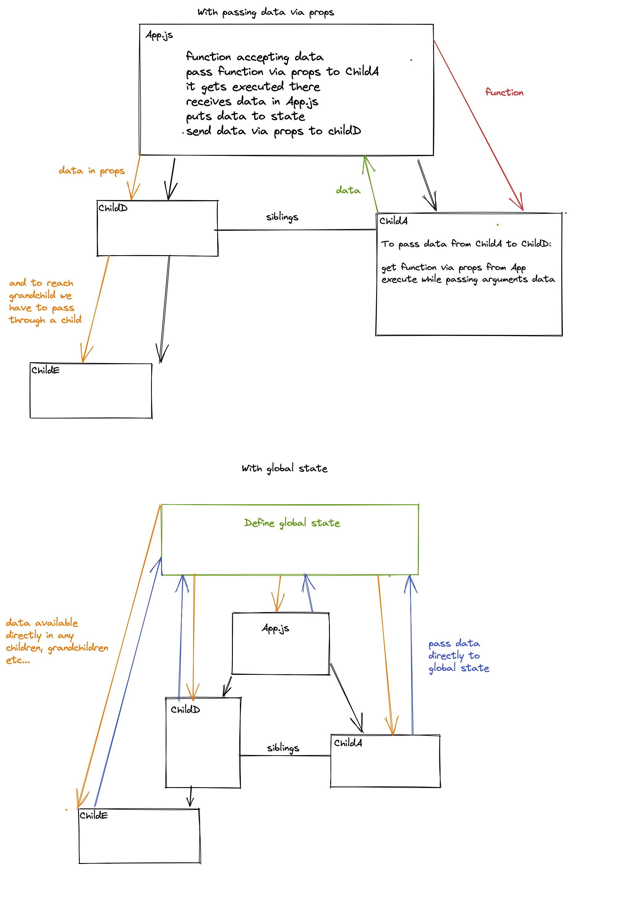

# Global state management with Recoil

Recoil is a global state manager for React apps, even if it is not stable yet it looks very promising.

A state manager is something useful when your application grow, instead of passing the props down from a parent component to a child it allows you to create a global state that can be accessed from any component in your app. 



Unlike others state managers, Recoil is very developer friendly, the structure is not convoluted at all, in fact one of its characteristics is simplicity.

The syntax is very similar to React, so much that while you are learning it you don't feel like learning another library.

<iframe src="https://codesandbox.io/embed/goofy-fire-1sohi?autoresize=1&fontsize=14&hidenavigation=1&theme=dark"
     style="width:100%; height:500px; border:0; border-radius: 4px; overflow:hidden;"
     title="recoil-overview"
     allow="accelerometer; ambient-light-sensor; camera; encrypted-media; geolocation; gyroscope; hid; microphone; midi; payment; usb; vr; xr-spatial-tracking"
     sandbox="allow-forms allow-modals allow-popups allow-presentation allow-same-origin allow-scripts"
   ></iframe>

## How to start 

We need, first, to install Recoil inside our project 

```js
   npm install recoil
```

In order to be able to use recoil in our project, we need to wrap our app with the RecoilRoot component, a good place would be in index.js

```js
import { RecoilRoot } from "recoil";

ReactDOM.render(
  <React.StrictMode>
    <RecoilRoot>
      <App />
    </RecoilRoot>
  </React.StrictMode>,
  document.getElementById("root")
);
```

## Atoms

An Atom represent single value inside the state.

We need to import the atom element from Recoil first. Let's make a file `state.js` in the `src` folder and add this there:

```js
import { atom } from 'recoil'
```
Then we can create a variable an assign it as a value the result of the atom method, the atom method takes 1 argument, an object with 2 keys (key,default) "key" is used by React to recognize elements and must be unique "default" is the initial value of the element in the state.js

```js
export const nameState = atom({
  key: 'nameState',
  default: 'Mario',
});
```

Now we can import the variable name in the components where we need to use it.

Recoil provides you a series of methods to interact with the elements in the state, lets see some of them :

**useRecoilState  :** it works like the useState hook, you have a variable and a setter method

```js
// import useRecoilState from the package recoil
import { useRecoilState } from 'recoil'
// import nameState from the file state.js
import { nameState } from './state.js'

const App = () => {
    const [name, setName] = useRecoilState(nameState)
}
```

**useRecoilValue  :** it will give you access to a specific value in the state, you can use it but you can't modify it

```js
// import useRecoilValue from the package recoil
import { useRecoilValue } from 'recoil'
// import nameState from the file state.js
import { nameState } from './state.js'

const App = () => {
    const name = useRecoilValue(nameState)
}
```

**useSetRecoilState  :** it will give you access to a setter method of a specific value from the state, you can use it if you just need to modify some value in the state

                         
```js
// import useSetRecoilState from the package recoil
import { useSetRecoilState } from 'recoil'
// import nameState from the file state.js
import { nameState } from './state.js'

const App = () => {
    const setName = useSetRecoilState(nameState)
}
```

Lets suppose that we have a React counter app using Recoil, the structure would be like this:

```
src _________
             |__ components ____
             |                  |___  App.js
             |                  |
             |                  |___  counter.js
             |                  |
             |                  |___  button.js
             |
             |__ utils _________
             |                  |___  state.js
             |
             |__ index.js
```

As you can see inside the utils folder we have a file called state.js, in this file is where we are going to create the atoms.

```js
//state.js
import { atom } from 'recoil'

export const counterState = atom({
  key: 'counterState',
  default: 0,
});
```

index.js is where we wrap our app with the RecoilRoot component

```js
// index.js
import React from 'react';
import ReactDOM from 'react-dom';
import App from './components/App';

import { RecoilRoot } from "recoil";

ReactDOM.render(
  <React.StrictMode>
    <RecoilRoot>
      <App />
    </RecoilRoot>
  </React.StrictMode>,
  document.getElementById("root")
);
```

```js
//App.js
import React from 'react';
import { useSetRecoilState } from 'recoil';

import Display from './display.js';
import Button from './button.js';

import { counterState } from '../utils/state.js'

const App = () => {
   const setCounter = useSetRecoilState(counterState)
   return <div>
            <Display/>
            <Button/>
            <button onClick={()=>setCounter(0)}>Reset Counter</button>
         </div>
}
export default App
```

```js
// Display.js
import React from 'react';
import { useRecoilValue } from 'recoil';

import { counterState } from '../utils/state.js'

const Display = () => {
   const counter = useRecoilValue(counterState)
   return <h1>{counter}</h1>
}
export default Display
```

```js
// Button.js
import React from 'react';
import { useRecoilState } from 'recoil';

import { counterState } from '../utils/state.js'

const Button = () => {
   let [counter, setCounter] = useRecoilState(counterState)
   return <button type='button' onClick={()=>setCounter(counter+=1)}>Click me</button>
}
export default Button
```


## Selectors  

A selector is a piece of derived state. You can think about derived state as an element from the state that after passing through a function has been modified.

We need to import selector from the package recoil

```js
import { atom, selector } from 'recoil'
```

```js
export const counterState = atom({
  key: 'counterState',
  default: 0,
});

export const doubleCounterState = selector({
  key: 'doubleCounterState',
  get: ({ get }) => {
    const counter = get(counterState)
    return counter * 2;
  }
});
```

As you can see, the selector also needs a unique key.

In the example above we have a get method that takes a get method as argument, this get method is used to import other values from the state inside the selector.

In this case we have a read-only selector, it is going to keep in memory the values that we imported and re-render if they change but is not going to modify the original state.


## Fetching using Recoil

We will probably need to fetch data from some API at some point, using Recoil we can do it with the help of React Suspense.

Lets suppose we have a React app that is going to fetch a random user from the random user API.

The structure will be : 

```
src _________
             |__ components ____
             |                  |___  App.js
             |                  |
             |                  |___  user.js
             |
             |__ utils _________
             |                  |___  state.js
             |
             |__ index.js
```

```js
// App.js
import React, { Suspense } from 'react';

import User from './user';

const App = () => {
  return <div>
            <Suspense fallback={<h1>Loading...</h1>}>
               <User/>
            </Suspense>
         </div>
}
export default App
```


```js
// state.js
import { selector } from 'recoil'
import axios from 'axios';

export const randomUser = selector({
  key: "randomUser",
  get: async ({ get }) => {
    const { data } = await axios.get('https://randomuser.me/api');
    console.log(data)
    return data.results[0];
  },
});
```

## Demo of using Recoil for global state to hot-reload quantity of products in cart in the navbar:

Repo: https://gitlab.com/gk3000/cart-qty-global-state-recoil

Live demo: https://cart-qty-global-state-recoil.surge.sh/

## Demo of using Recoil for global state to fetch the movies from the external API and share the data between the components:

Repo: https://gitlab.com/barcelonacodeschool/movies-recoil

Live demo: http://recoil-global-state.surge.sh
