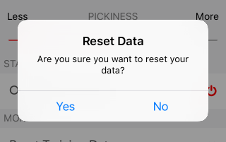

# React native 03

## ScrollView

https://reactnative.dev/docs/scrollview

```javascript
import React from 'react';
import { StyleSheet, Text, View, ScrollView } from 'react-native';
var arr =[]
for(var i =0; i < 1000; i++){
  arr.push('something')
}
export default class App extends React.Component {
  render() {
    return (
      <View style={styles.container}>
        <ScrollView>
          { 
            arr.map((ele, i)=>(
              <Text key={i}>{ele}</Text>
            )) 
          }
        </ScrollView>
      </View>
    );
  }
}

const styles = StyleSheet.create({
  container: {
    flex: 1,
    backgroundColor: '#fff',
    alignItems: 'center',
    justifyContent: 'center',
  },
});
```

## Alert

https://reactnative.dev/docs/alert

Alerts in React Native can be used to display some important message to the user but also to allow the user to confirm a choice, such as confirming before deleting an item.

<!--  -->


They can also be used to supply a list of actions that the user may want to do saving some valuable space from the screen.

Let’s see an example of a possible use of them to confirm deletion of an item.

```javascript
    // Works on both iOS and Android

import React from 'react';
import { StyleSheet, View, Button, Alert } from 'react-native';

export default function App () {

  const myAlert =()=> 
  Alert.alert(
    'Alert Title',
    'My Alert Msg',
    [
    {text: 'Ask me later', onPress: () => console.log('Ask me later pressed')},
    {text: 'Cancel', onPress: () => console.log('Cancel Pressed'), style: 'cancel'},
    {text: 'OK', onPress: () => console.log('OK Pressed')},
    ],
    { cancelable: false }
    )

    return (
      <View style={styles.container}>
      <Button title={'Alerting'} onPress={myAlert} />
      </View>
      );
}

const styles = StyleSheet.create({
  container: {
    flex: 1,
    backgroundColor: '#fff',
    alignItems: 'center',
    justifyContent: 'center',
  },
});
```

## picker

https://github.com/react-native-picker/picker

A picker can be useful to allow the user to select between options, like a `select` tag in the DOM. We can use the React Native picker importing it as any other tag.

In order to be able to use the Picker it has to be installed.

From the terminal, from inside the folder of your project run

``` 
npm install @react-native-picker/picker
```

Remember to import the Picker at the top of your file

```javascript
import { Picker } from '@react-native-picker/picker';
```
Let’s see an example of a Picker to used to allow the user to pick a currency.

```javascript
import React, {useState} from 'react';
import { StyleSheet, View, Button, Alert } from 'react-native';
import { Picker } from '@react-native-picker/picker';

export default function App () {

  const [currency, setCurrency] = useState('EURO €')

  return (
    <View style={styles.container}>
      <Picker
      style={{ height: 50, width: 100 }}
      itemStyle={{color:'orange'}}
      selectedValue={currency}
      onValueChange={ (itemValue, itemIndex) => setCurrency(itemValue) }>
        <Picker.Item label="GPB £" value="GPB £" />
        <Picker.Item label="USD  $" value="USD $" />
        <Picker.Item label="EURO €" value ="EURO €"/>
        <Picker.Item label="THB  ฿" value ="THB ฿"/>
        <Picker.Item label="CYN  ¥" value ="CYN ¥"/>
        <Picker.Item label="SGD  S$" value ="SGD S$"/>
      </Picker>
    </View>
    );
}

const styles = StyleSheet.create({
  container: {
    flex: 1,
    backgroundColor: '#fff',
    alignItems: 'center',
    justifyContent: 'center',
  },
});
```
Pretty simple eh?

Once we have the currency in the state we can freely use it in our application!

## FlatList

https://reactnative.dev/docs/flatlist

A performant interface for rendering basic, flat lists, supporting the most handy features:

* Fully cross-platform.
* Optional horizontal mode.
* Configurable viewability callbacks.
* Header support.
* Footer support.
* Separator support.
* Pull to Refresh.
* Scroll loading.
* ScrollToIndex support.
* Multiple column support.

```javascript
import React from 'react';
import { SafeAreaView, View, FlatList, StyleSheet, Text } from 'react-native';
import Constants from 'expo-constants';

const DATA = [
  {
    id: 'bd7acbea-c1b1-46c2-aed5-3ad53abb28ba',
    title: 'First Item',
  },
  {
    id: '3ac68afc-c605-48d3-a4f8-fbd91aa97f63',
    title: 'Second Item',
  },
  {
    id: '58694a0f-3da1-471f-bd96-145571e29d72',
    title: 'Third Item',
  },
];

function Item({ title,id }) {
  return (
    <View style={styles.item}>
      <Text style={styles.title}>{title} id:{id}</Text>
    </View>
  );
}

export default function App() {
  return (
    <SafeAreaView style={styles.container}>
      <FlatList
        data={DATA}
        renderItem={({ item }) => <Item title={item.title} id={item.id} />}
        keyExtractor={item => item.id}
      />
    </SafeAreaView>
  );
}

const styles = StyleSheet.create({
  container: {
    flex: 1,
    marginTop: Constants.statusBarHeight,
  },
  item: {
    backgroundColor: '#f9c2ff',
    padding: 20,
    marginVertical: 8,
    marginHorizontal: 16,
  },
  title: {
    fontSize: 32,
  },
});
```

## Navigation menu 

https://callstack.github.io/react-native-paper/bottom-navigation.html

Bottom navigation provides quick navigation between top-level views of an app with a bottom navigation bar. It is primarily designed for use on mobile.

For integration with React Navigation, you can use [react-navigation-material-bottom-tab-navigator](https://github.com/react-navigation/react-navigation-material-bottom-tab-navigator).

By default Bottom navigation uses primary color as a background, in dark theme with adaptive mode it will use surface colour instead. See [Dark Theme](https://callstack.github.io/react-native-paper/theming.html#dark-theme) for more informations

```javascript
import * as React from 'react';
import { BottomNavigation, Text } from 'react-native-paper';

const MusicRoute = () => <Text>Music</Text>;

const AlbumsRoute = () => <Text>Albums</Text>;

const RecentsRoute = () => <Text>Recents</Text>;

export default class MyComponent extends React.Component {
  state = {
    index: 0,
    routes: [
      { key: 'music', title: 'Music', icon: 'queue-music' },
      { key: 'albums', title: 'Albums', icon: 'album' },
      { key: 'recents', title: 'Recents', icon: 'history' },
    ],
  };

  _handleIndexChange = index => this.setState({ index });

  _renderScene = BottomNavigation.SceneMap({
    music: MusicRoute,
    albums: AlbumsRoute,
    recents: RecentsRoute,
  });

  render() {
    return (
      <BottomNavigation
        navigationState={this.state}
        onIndexChange={this._handleIndexChange}
        renderScene={this._renderScene}
      />
    );
  }
}
```

## SecureStore

https://docs.expo.io/versions/latest/sdk/securestore/

Provides a way to encrypt and securely store key–value pairs locally on the device. Each Expo project has a separate storage system and has no access to the storage of other Expo projects.

iOS: Values are stored using the keychain services as kSecClassGenericPassword. iOS has the additional option of being able to set the value's kSecAttrAccessible attribute, which controls when the value is available to be fetched.

Android: Values are stored in SharedPreferences, encrypted with Android's Keystore system.

**Size limit for a value is 2048 bytes**. 

## Debugging in React Native

Not unlike in the web, in RN we can use the already familiar debugger to check what is what at any given time. In order to start debugging in iOS we first need to start our iOS emulator (OSX only) by pressing run on ios emulator button in Expo online IDE and selecting "Open on iOS emulator. Once the app is running then press cmd + d and select "Debug Remote JS", it will open the browser for us. Then all you have left to do is to open the browser's dev tools and start placing debuggers where you need them!

## Swipeout

Run 
`npm i react-native-swipe-list-view`

https://github.com/jemise111/react-native-swipe-list-view
https://snack.expo.io/@jemise111/react-native-swipe-list-view

```javascript
//===========================================================
//================  PARENT COMPONENT  =======================
//===========================================================
import React, { useState } from 'react';
import {
    StyleSheet,
    View,
} from 'react-native';

import Swipeable from './swipeable.js';


export default function App() {

    return (
        <View style={styles.container}>
            <Swipeable/>
        </View>
    );
}

const styles = StyleSheet.create({
    container: {
        backgroundColor: 'white',
        flex: 1
    }
});
```

```javascript
//===========================================================
//================  swipeable.js  ====================
//===========================================================
import React, { useState } from 'react';
import {
    StyleSheet,
    Text,
    TouchableOpacity,
    TouchableHighlight,
    View,
} from 'react-native';

import { SwipeListView } from 'react-native-swipe-list-view';

export default function Basic() {
    const [listData, setListData] = useState(
        Array(20)
            .fill('')
            .map((_, i) => ({ key: `${i}`, text: `item #${i}` }))
    );

    const closeRow = (rowMap, rowKey) => {
        if (rowMap[rowKey]) {
            rowMap[rowKey].closeRow();
        }
    };

    const deleteRow = (rowMap, rowKey) => {
        closeRow(rowMap, rowKey);
        const newData = [...listData];
        const prevIndex = listData.findIndex(item => item.key === rowKey);
        newData.splice(prevIndex, 1);
        setListData(newData);
    };

    const onRowDidOpen = rowKey => {
        console.log('This row opened', rowKey);
    };

    const renderItem = data => (
        <TouchableHighlight
            onPress={() => console.log('You touched me')}
            style={styles.rowFront}
            underlayColor={'#AAA'}
        >
            <View>
                <Text>I am {data.item.text} in a SwipeListView</Text>
            </View>
        </TouchableHighlight>
    );

    const renderHiddenItem = (data, rowMap) => (
        <View style={styles.rowBack}>
            <Text>Left</Text>
            <TouchableOpacity
                style={[styles.backRightBtn, styles.backRightBtnLeft]}
                onPress={() => closeRow(rowMap, data.item.key)}
            >
                <Text style={styles.backTextWhite}>Close</Text>
            </TouchableOpacity>
            <TouchableOpacity
                style={[styles.backRightBtn, styles.backRightBtnRight]}
                onPress={() => deleteRow(rowMap, data.item.key)}
            >
                <Text style={styles.backTextWhite}>Delete</Text>
            </TouchableOpacity>
        </View>
    );

    return (
        <View style={styles.container}>
            <SwipeListView
                data={listData}
                renderItem={renderItem}
                renderHiddenItem={renderHiddenItem}
                leftOpenValue={75}
                rightOpenValue={-150}
                previewRowKey={'0'}
                previewOpenValue={-40}
                previewOpenDelay={3000}
                onRowDidOpen={onRowDidOpen}
            />
        </View>
    );
}

const styles = StyleSheet.create({
    container: {
        backgroundColor: 'white',
        flex: 1,
    },
    backTextWhite: {
        color: '#FFF',
    },
    rowFront: {
        alignItems: 'center',
        backgroundColor: '#CCC',
        borderBottomColor: 'black',
        borderBottomWidth: 1,
        justifyContent: 'center',
        height: 50,
    },
    rowBack: {
        alignItems: 'center',
        backgroundColor: '#DDD',
        flex: 1,
        flexDirection: 'row',
        justifyContent: 'space-between',
        paddingLeft: 15,
    },
    backRightBtn: {
        alignItems: 'center',
        bottom: 0,
        justifyContent: 'center',
        position: 'absolute',
        top: 0,
        width: 75,
    },
    backRightBtnLeft: {
        backgroundColor: 'blue',
        right: 75,
    },
    backRightBtnRight: {
        backgroundColor: 'red',
        right: 0,
    },
});
```