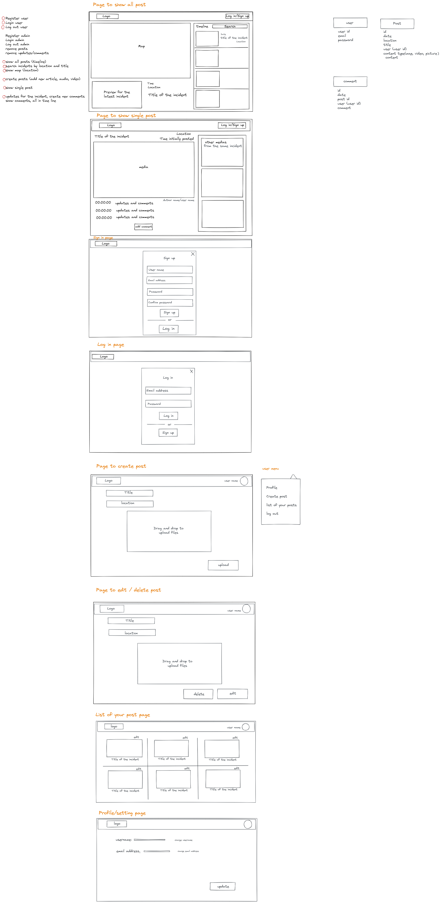

First things first... 👇

## Todo App with a client, server, db

We suggest to make a simple full-stack exercise to see how data travels between the client and backend. Use the express exercise with the DB and build a react client for it. It will help to better grasp the full-stack concept on a simple task.

<details>
    <summary>🎬 Video: Connecting React client with Express server</summary><div class='video-container'>
        <iframe src="https://www.youtube.com/embed/j-jd8P19Kfg?rel=0" frameborder="0" allow="accelerometer; autoplay; encrypted-media; gyroscope; picture-in-picture" allowfullscreen ></iframe></div>
</details>

[Sample code from the video](https://gitlab.com/gk3000/linkingClientWithServerExample)

---

# Useful repos for your your projects:

We have prepared several sample repos which could be useful for your projects. They are accompanied with the video lessons to help you to learn the implementations of the following advanced features:

## Authentication with JWT

[JSON Web Token](https://jwt.io/), more commonly known as JWT, is an open standard allowing to create tokens with secure signature which we can use to perform sensitive operations like user authentication.

In the following implementation user fills out the registration form with email and password which are sent to the server. Server is checking if current email doesn't exist in the users database. If it does -- server responds with "User already exists" response.

Otherwise, server creates a new records in the users DB saving the email and password in the DB. The password is hashed (encrypted) so that we never store plain text passwords in the DB.

After that user is going to the Login page and enters their credentials. They are sent to the server there we are checking if user's email exists in the DB of users. If it doesn't -- server responds with "User not found" message. Otherwise server is comparing passwords and if they match send "Ok" response with a token generated for this particular user.

In the client we save this token in localStorage. The token is basically saying "this is a certain user and they are logged in". So that when user is browsing through our website they can open any protected/private pages without a need to log in again and again. This happens because for every protected URL first thing we check if there is a token which allows user to see this content. If there is, we allow user to visit a certain URL.

▶︎ [Code repo (client and server)](https://gitlab.com/barcelonacodeschool/authentication_JWT)

<details>
    <summary>🎬 Video: Authentication with JWT</summary><div class='video-container'>
        <iframe src="https://www.youtube.com/embed/my0zlUbwKms?rel=0" frameborder="0" allow="accelerometer; autoplay; encrypted-media; gyroscope; picture-in-picture" allowfullscreen ></iframe></div>
</details>

---

## Passwordless authentication 

Passwordless authentication is based on the user's email used for both sign up and login. If user account doesn't exist we create it and send a link to confirm and login. A token is placed into the localStorage to keep user logged in. 

If user's account does exist already and token is expired then user is asked for the email and we generate a new link in the server and send it to the user's email. Once clicked we verify the user email and link to match and if they do place a token into the localStorage and let user in.  

▶︎ [Code repo (client and server)](https://gitlab.com/gk3000/magic-link-auth/-/tree/withclient)

<details>
    <summary>🎬 Video: Passwordless authentication</summary><div class='video-container'>
        <iframe src="https://www.youtube.com/embed/pAD-2ZEGqZo?rel=0" frameborder="0" allow="accelerometer; autoplay; encrypted-media; gyroscope; picture-in-picture" allowfullscreen ></iframe></div>
</details>

---

## Sending emails with Nodemailer

[Nodemailer](https://nodemailer.com/about/) is a node module which makes sending emails a very easy task. It's de facto a standard solution for sending emails with Node server since 2010.

First of all we need to install it in the server with `npm i nodemailer` and then following the documentation we configure it to be able to use a certain mailbox as an outgoing address for the email our app will send to the users. It could be confirmation emails, contact form submissions, notifications of all sorts, etc...

We can pre-define the templates for the emails and then inject the data we receive from the client or get from the DB into the outgoing emails.

▶︎ [Code repo (client and server)](https://gitlab.com/barcelonacodeschool/nodemailer_sending_emails)

<details>
    <summary>🎬 Video: Sending emails with Nodemailer</summary><div class='video-container'>
        <iframe src="https://www.youtube.com/embed/fGYiWJkU_rw?rel=0" frameborder="0" allow="accelerometer; autoplay; encrypted-media; gyroscope; picture-in-picture" allowfullscreen ></iframe></div>
</details>

---

## Online card payments with Stripe

Whenever you want to start accepting card payments at your website [Stripe](https://stripe.com/) would be a go-to solution.

You will need to create an account at stripe.com and after that you will have an access to the dashboard with test/development mode where you will see all the test transactions.

There are several ways of implementing Stripe and we will see the one called Stripe Checkout. From our Cart page you will pass the total to Stripe Checkout where user will have to enter their card details after which we are sending request to Stripe server which process the charge and responds with success or failure.

▶︎ [Payments code repo (client and server)](https://gitlab.com/barcelonacodeschool/stripe_card_payments)

<details>
    <summary>🎬 Video: online card payments with Stripe</summary><div class='video-container'>
        <iframe src="https://www.youtube.com/embed/7ysjDJKJc48?rel=0" frameborder="0" allow="accelerometer; autoplay; encrypted-media; gyroscope; picture-in-picture" allowfullscreen ></iframe></div>
</details>

---

## Image upload custom built without third-party APIs

In this tutorial we will show you how to build an image upload form from scratch and save uploaded videos in your server with getting URLs for them which we can use to render images or save those URLs into the database. The benefits of this approach, compared to using external storage like in the tutorial below, is that you keep all the images on your own server and not using any third-party solution. The drawback could be if your users will upload a lot of images you will need to monitor and if needed increase the hard drive space given by your web host.

▶︎ [Code repo](https://gitlab.com/gk3000/single-image-upload)

<details>
    <summary>🎬 Video: uploading images to the server</summary><div class='video-container'>
        <iframe src="https://www.youtube.com/embed/elIpXviAdwc?rel=0" frameborder="0" allow="accelerometer; autoplay; encrypted-media; gyroscope; picture-in-picture" allowfullscreen ></iframe></div>
</details>

---

## Image upload Cloudinary API

[Cloudinary](https://cloudinary.com) is a platform for storing images and videos which offers API to be used programmatically. We can embed a Cloudinary widget into our app which let's users to choose and upload images into our app.

You will need to create a Cloudinary account after which you will get the API keys to use. Then you can embed a Cloudinary widget into our app which let's users to choose and upload images into our app. Every image (file) uploaded by the user is sent to Cloudinary server to be kept in your cloud folder and in response Cloudinary server will send the url of the image which you can render immediately or save in the DB.

▶︎ [Code repo](https://gitlab.com/barcelonacodeschool/cloudinary_react_express)

<details>
    <summary>🎬 Video: uploading images to Cloudinary</summary><div class='video-container'>
        <iframe src="https://www.youtube.com/embed/2umrx3qNAHM?rel=0" frameborder="0" allow="accelerometer; autoplay; encrypted-media; gyroscope; picture-in-picture" allowfullscreen ></iframe></div>
</details>

---

## Real-time chat

▶︎ [Code repo](https://socket.io/get-started/chat/)

---

## Automatically built admin area (for development only)

[AdminBro](https://adminbro.com/) is automatically generated dashboard which we can use to momentary have a fully-functioning admin area for working with our DB -- if we need to fill it up with data, check data, remove or modify before we will build routes and controllers.

All we need is to define the models and import them into adminBro. Based on the structure of our models the dashboard will render appropriate UI elements to work with data.

> The following repo should not be used in production since the access to admin area is not protected!

▶︎ [AdminBro example which creates an admin _unprotected_ area to use locally based only on the DB's schemas](https://gitlab.com/barcelonacodeschool/admin-bro-localhost)

<details>
    <summary>🎬 Video: local admin dashboard with AdminBro</summary><div class='video-container'>
        <iframe src="https://www.youtube.com/embed/a7J8tw9NUgA?rel=0" frameborder="0" allow="accelerometer; autoplay; encrypted-media; gyroscope; picture-in-picture" allowfullscreen ></iframe></div>
</details>

---

## Automatically built admin area with authentication (suitable for production)

This example of using AdminBro comes with protected admin route.

▶︎ [AdminBro example which creates an admin _protected_ area based on DB schemas](https://gitlab.com/barcelonacodeschool/admin-bro-express)

<details>
    <summary>🎬 Video: AdminBro admin dashboard with protected route</summary><div class='video-container'>
        <iframe src="https://www.youtube.com/embed/TYykJ8vlwTU?rel=0" frameborder="0" allow="accelerometer; autoplay; encrypted-media; gyroscope; picture-in-picture" allowfullscreen ></iframe></div>
</details>

---

## Some of the public APIs

▶︎ [Check out this list of public APIs to see some of the possibilities to use in your project](https://github.com/public-apis/public-apis)

---

# Setting up a project database

For the web project we suggest to use MongoDB Atlas (a remote version of MongoDB) instead of local MongoDB.

This way your project will use a unique database either in development or production and can be easily shared
with us.

[MongoDB Atlas](js_cur/_express/Express-block-03.5-MongoDB-Atlas.md)

---

# Setting up Axios

Axios provide a way to set a base url valid for all the requests, this is useful for cases when the url of our server

change and we need to update it in the client, instead of update it in each component we can update just the base url

and it will be applied to all requests that are using axios.

To do so we need to create a file called config.js inside the src folder of you React application.

The content of this file should be this:

```js
import axios from "axios";
// =======  preparing to the deplyment  ========
const URL =
    window.location.hostname === `localhost`
        ? `http://localhost:3030` // 3030 should be replaced with your server port
        : `http://IP_ADDRESS_OF_YOUR_DROPLET`; // it should be replaced with actual domain during the deployment
// =============================================
const customInstance = axios.create({
    baseURL: URL,
    headers: { Accept: "application/json" },
});

export default customInstance;
```

Then inside the components, istead of

```js
import axios from "axios";
```

we should

```js
import axios from "../config.js"; // the path could be different, depending on from where you import it
```

The requests now should be like these

```js
const response = await axios.get("/products/get_all"); // the path could be different
```

```js
const response = await axios.post("/products/create"); // the path could be different
```

---

# Metadata reminder:

A little details which makes a difference — for your projects and portfolio pages please make sure to add a title, description and favicon so that then opened in a browser or shared via social platforms the preview card will not display something like this:


But something like this:


With react it is easy to achieve with React Helmet — https://gk3000.gitlab.io/js_curriculum/#/js_cur/_react/React-07-React-Helmet which lets us use all the meta tags which normally go into the HTML `<head>` element — https://gk3000.gitlab.io/js_curriculum/#/js_cur/_html/HTML5?id=the-html-ltheadgt-element

There is an easy way to check your meta tags with websites like https://www.heymeta.com/

---

# UX Design workshops to build wireframes:

[360 video](https://www.youtube.com/playlist?list=PLryb4nu66MZc0LnXiNjMgR5bHdH7Kr1Kk)

Before starting to write code it's highly recommended to make wireframes which are a structural sketch of the views with functionality to make sure that each feature is represented in the sketch and for every action user can take there are UI elements/views. Here is an example of what wireframes might look like (done with https://excalidraw.com): 

---

<!-- # Starting server and client concurrently in development mode:

Assuming your project file structure is:

```
root folder
  client
  server
```

you can install npm package [concurrently](https://www.npmjs.com/package/concurrently) and add this script into your server's package.json:

```
"rundev": "concurrently \"nodemon index.js\" \"cd ../client && npm start\""
```

now with `npm run rundev` from your server folder you can start both apps concurrently -->
