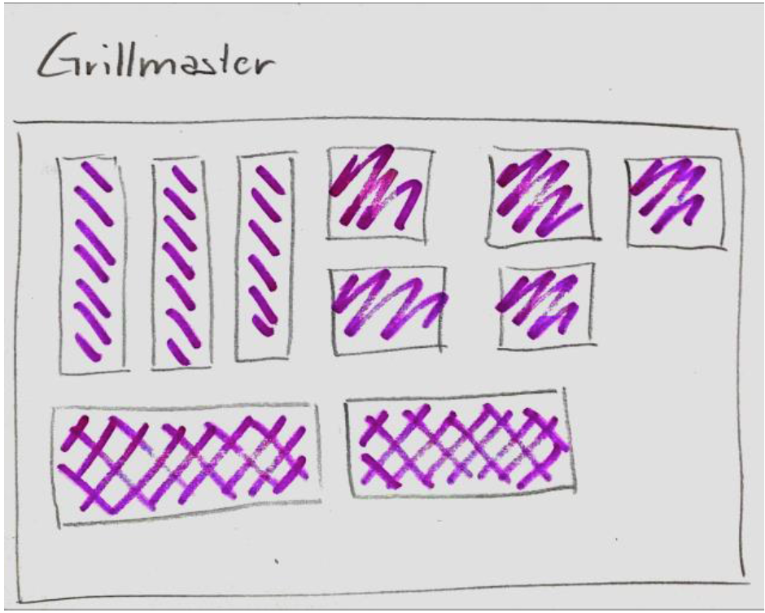

## Sample questions

### JavaScript
- Which data types exist in JavaScript? 
- How can we check the data type in JavaScript? 
- What does `isNaN` do?
- What kind of problem can we run into while using parseInt method?
- What is the difference between `==` and `===`?
- What is a namespace in JavaScript? How and when do we use it?
- We declare var `a = “Foo”, var b=”Bar”` and an object `obj={“Foo”: “Hello”, “Bar”: “World”}`. What would we have as an output for `console.log(obj.a + obj.b)` and `console.log(obj[a] + obj[b])`? Why do we have these results?
- What is `this`? 
- What is “callback hell” and how can we avoid it? 
- What is a closure in JavaScript?

### React
- Explain the differences between React Hooks and React classes.
- How is a controlled component different from an uncontrolled one?
- Briefly explain how this.setState works.
- How do you convert a function to a class in React?
- What are the benefits of composition over inheritance in React?
- What are your favorite React component libraries and why?
- What's your approach to data fetching server-side?
- How do you test the apps you've built with React?
- How do you use React without using JSX?
- What's wrong with copying props to state?
- When should you use React refs?
- What is a higher-order component in React?


## Challenges

– Create an accordion, i.e. a group of panels with only the header visible initially and when clicked on the header they should see the extra content expanded and hide another one if it is expanded. Something similar to the Bootstrap Accordion but without using Bootstrap. You can use any approach but no UI elements from external libraries. We will evaluate the clarity of your code and the visual results seen by the user. 

– Imagine you have an input form with several input fields. We need to validate the data before sending them to the server. How would you do it? We can have data of different kind, like text, numbers, email address, phone number, etc. 

– [GitHub API challenge](https://github.com/gk3000/FrontendTest)

### Tic Tac Toe

TIC TAC TOE 2.0
We want to bring the pen-and-paper game Tic-tac-toe to the digital age,
but with a little twist: the size of the playfield should be
configurable between 3x3 and 10x10. And we also want the symbols
(usually O and X) to be configurable.

General Rules: https://en.wikipedia.org/wiki/Tic-tac-toe

The user will play against the computer. Who is starting is random. In
and output should be on the console. After each move, the new state of
the playfield is displayed and the player can enter the next position
of their character. The next position should be provided in a format
like 3,2. Invalid inputs are expected to be handled appropriately.

Requirements:
- Use the programming language you feel most comfortable with
- The game takes 3 inputs:
- Size of the playground. Valid values are between 3 and 10.
- Play character 1 and 2:
- A single character for the human player
- A single character for the computer
- These configurations can be either provided via the console or a
file.
- Software design is more important than a highly developed AI

Rules:
- You may use external libraries only for testing or building purposes
e.g. JUnit, Gradle, Rspec, Rake, GulpJS, etc.
- Please provide an explanation how to run your code
- Please explain your design decisions and assumptions
- Don't include executables (1) in your submission.
- Please write your solution in a way, that you would feel comfortable
handing this over to a colleague and deploy it into production.
- We especially look at design aspects (e.g. OOP) and if the code is
well tested and understandable.

(1) Executables include: asp, bat, class, cmd, com, cpl, dll, exe, fon, hta,
ini, ins, iw, jar, jsp, js, jse, pif, scr, shs, sh, vb, vbe, vbs, ws,
wsc, wsf, wsh & msi

### Grill master

Introduction
Please review and solve the following task within a week and factual in less than 4 hours. Please return the resulting project containing all HTML, CSS and JS artefacts in a ZIP file to your contact person.
We’d like you to use a known JavaScript framework such as Angular and you need to test you solution on both IE11 and Chrome.

Task Description
Please help the Grill Master to plan his next Grill Session. You can do so by showing him the optimal way to place all the meat and vegetables on the Grill and illustrate your proposal with a graphical arrangement of all the items on the Grill. We’ve created a wireframe of how this graphical UI for the Grill Master App can look like (but would be impressed and if you can beautify it).

<!--  -->


You’ll find the “data” for this task below

```
<grill width="20" height="15"> 
	<grillitems> 
		<grillitem width="5" height="4" count="6" title="Steak" /> 
		<grillitem width="8" height="2" count="5" title="Sausage" /> 
		<grillitem width="3" height="3" count="4" title="Tomato" /> 
		<grillitem width="4" height="3" count="8" title="Veal" /> 
	</grillitems> 
</grill>
```

So to summarize: Your App will read the items that you’ll need to place on the Grill from the XML file, then proposes an optimal arrangement of those items on the Grill and illustrates this proposal graphically in a smart UI.
Ps, when you cannot place all the items on the Grill you will need to provide a readable list in the UI that lists the items not on the Grill.
Keep a keen eye on the quality of your project, code etc.

<!-- ### Full-stack test 

- front-end challenge
- API challenge 
- DB design challenge

[full description](https://barcelonacodeschool.com/files/docs/full-stack_sample_test.pdf) -->