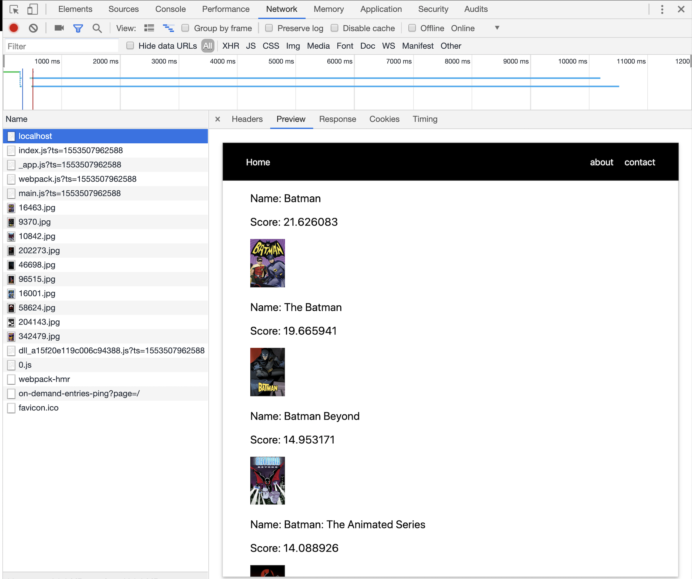

# Working with Asynchronous data

In order to fetch data and render it server side using next we can use the getInitialProps method.
This static method gets called server side and allows us to render actual content on the first page load.
Unlike with create-react-app we won't first render an empty `div`, and then append content to it with JavaScript, instead we will first render a static HTML which already contains our data, and then a few ms later we will add interactivity when we load our webpack bundle.

Let's install `axios` running:
```
npm i --save axios
```
Let's replace the content of index.js with the following :
```
import React from 'react'
import axios from 'axios';

import Layout from '../components/layout';
const Home = ({shows}) =>
  <Layout>
      <main className="hero">
        <ul style={{listStyle:'none'}}>
          {shows.map(({show, score}, i)=>
            <li key ={i}>
              <p>Name: {show.name}</p> 
              <p>Score: {score}</p>
              
            </li>
          )}
        </ul>
      </main>
  </Layout>

export default Home;

Home.getInitialProps = async () => {
  const res = await axios.get('https://api.tvmaze.com/search/shows?q=batman')
  return {
    shows: res.data
  }
}
```
With this simple app we are fetching some information about Batman from an external API, only we are not doing it in componentDidMount as we previously did, we are doing it server side using getInitialProps.
We return our data from getInitialProps and it will then be available in our props.

To see the difference let's examine the network tab in the Chrome dev tools after loading the page.
<!--  -->


We can see here that when the page was first loaded it came with all our asynchronously fetched content, and that is awesome!

## Working with classes

Now let's say that we need state in our application in case we want to let the user search for something other than Batman! 

Let's refactor our component to be a class.

Let's first do a version 1 where we it will be identical to the function component version, only it will be using a class-based component, we will add state and an input later on...

To use getInitialProps in our component we need to create a class level method as opposite to a class instance level method, in order to do that we need to use the keyword static.

### Static methods

[Static methods MDN](https://developer.mozilla.org/en-US/docs/Web/JavaScript/Reference/Classes/static)

> A static method is a class level method, unlike a regular method declared inside a class, which is a class instance  method, what this means is that a static method can be called directly from the class and we don't need to create a new instance of the class using the new keyword.

Let's consider the example below:
```
class Test {
	sayHi(){
		console.log('hello')
	}
	static iamStatic(){
		console.log('I am static ...')
	}
}
Test.sayHi
// undefined
The method sayHi is undefined
Test.iamStatic()
// I am static ...
The method iamStatic is available and ready to use!
const test = new Test();
test.sayHi();
// hello
sayHi is defined in the new instance of the class, while iamStatic is not.
```
Now that we know a bit more about what a static method is, let's go back to our class in Next.js!

```
import React from 'react'
import axios from 'axios';
import Layout from '../components/layout';

export default class Home extends React.Component {
  static getInitialProps = async () => {
      const res = await axios.get('https://api.tvmaze.com/search/shows?q=batman')
      return {
          shows: res.data
      }
  }
  render(){
    const  { shows } = this.props;
    return(
      <Layout>
        <main className="hero">
          <ul style={{listStyle:'none'}}>
            {shows.map(({show, score}, i)=>
              <li key ={i}>
                <p>Name: {show.name}</p> 
                <p>Score: {score}</p>
                
              </li>
            )}
          </ul>
        </main>
      </Layout>
    )
  }
}

```

Now we need to modify this class a bit, because we want to be able to change the content, allowing the user to search what he wants with a user input, so we are going to need a form with an input and a button, an onChange and an onSubmit handler, and of course state!

```
import React from 'react'
import axios from 'axios';
import Layout from '../components/layout';

export default class Home extends React.Component {
  constructor(props){
    super(props)
    this.state = {
      shows:props.shows,
      search:''
    }
  }
  static getInitialProps = async () => {
      const res = await axios.get('https://api.tvmaze.com/search/shows?q=batman')
      return {
          shows: res.data
      }
  }
  search = async (keyword) => {
    const res = await axios.get(`https://api.tvmaze.com/search/shows?q=${keyword}`);
    this.setState({shows:res.data})
  }
  handleChange = e => this.setState({search:e.target.value});
  handleSubmit = e => {
    e.preventDefault();
    this.search(this.state.search)
  }
  render(){
    const  { shows } = this.state;
    return(
      <Layout>
        <main className="hero">
        <form onSubmit = {this.handleSubmit}>
          <input
            value = {this.state.search}
            onChange = {this.handleChange}
          />
          <button>search</button>
        </form>
          <ul style={{listStyle:'none'}}>
            {shows.map(({show, score}, i)=>
              <li key ={i}>
                <p>Name: {show.name}</p> 
                <p>Score: {score}</p>
                
              </li>
            )}
          </ul>
        </main>
      </Layout>
    )
  }
}

```